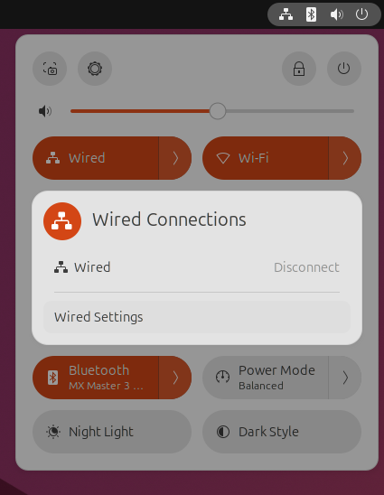
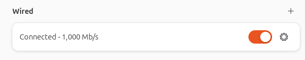
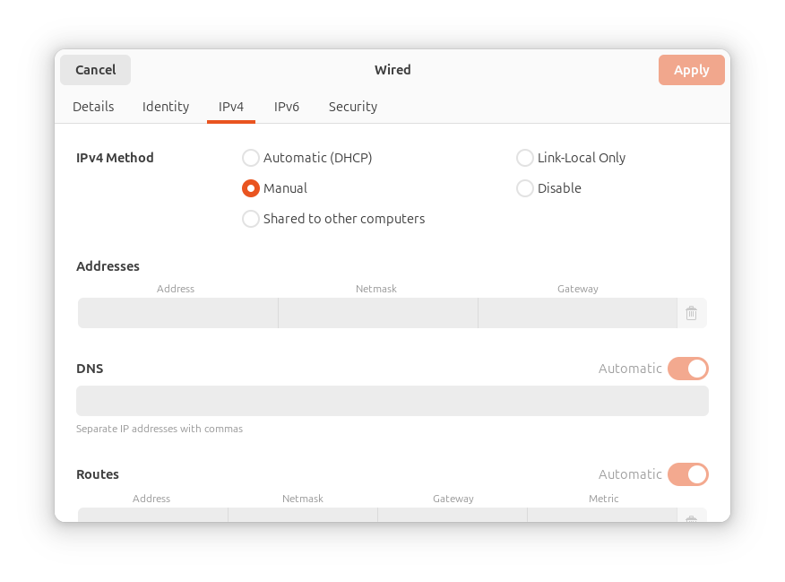
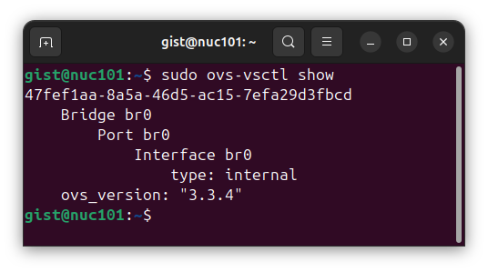

# Lab#1. Box Lab

# 0. Objective


In the Box Lab, we will install the operating system(OS) directly on \*bare metal,
then launch virtual machines and containers within it, and connect them to each other using a virtual switch.

\*Bare metal: a hardware without any installed software

Let's take a close look at the overall structure.


# 1. Theory


> [!NOTE]
>
> - Virtual Machine
>
>   Within a single physical machine, you can create multiple virtual machines, each functioning as an independent system. Each virtual machine operates separately and is allocated its own dedicated resources. Additionally, users can freely choose and install an OS different from the host OS on each virtual machine. From a usage perspective, virtual machines and physical machines may feel nearly identical. However, virtual machines are significantly heavier than containers and take longer to create.  
>   However, there are cases where using a VM is better compared to a container.
>
> 1. When running an application that only works in a specific OS environment  
>    If you need to run a program that was developed long ago and only works in a specific OS environment, or if the program was intentionally designed to run exclusively on a particular OS by its developer, using a VM is necessary.
> 2. In security-sensitive environments  
>    Unlike containers, VMs do not share the OS between instances, providing a higher level of isolation. In cases where a high level of security is required, such as services handling financial data, VMs may be more suitable than containers.
>
> In this lab, we will use the KVM Hypervisor, which is natively built into Linux, to create virtual machines.
>
> - Container
>
>   One of the key differences between containers and virtual machines is that containers do not have an independent Guest OS layer. Unlike virtual machines, containers share the OS of the physical machine (Host OS). While virtual machines are fully independent, containers are not. The Docker Engine runs on top of the Host OS, allowing isolated environments to be created without the need for individual Guest OS instances. Due to this architecture, containers are much lighter and faster than virtual machines, and creating or deleting container environments is relatively simple.  
>   Cases Where Using Containers is Beneficial
>
> 1. When fast deployment of an application is required  
>    Using containers allows you to quickly set up and deploy the application environment. Compared to VMs, containers have shorter startup times, making them more advantageous for fast deployment.
> 2. When Running Lightweight Applications  
>    For short-term temporary environments to test a specific program or run a lightweight application, using containers is a better choice.
>
> To build a container, we will use the Docker Runtime.


> [!NOTE]
>
> - Switch
>
>   A switch is a network device that connects and transmits data packets between network devices. Depending on the network layer at which it operates, there are L2, L3 switches, and others.
>
>   The key features of a switch are as follows:
>   1. Packet Forwarding  
>      An L2 switch forwards packets based on MAC addresses, serving as a fundamental network switch.
>      An L3 switch has IP routing capabilities, performing some functions of a router.
>   2. Full-Duplex Communication  
>      Switches support full-duplex communication, allowing simultaneous transmission and reception of data. This enhances network efficiency and speed.
>   3. VLAN Support  
>      Some advanced switches support VLAN (Virtual Local Area Network) functionality, enabling logical network segmentation. With VLANs, separate logical networks can exist within the same physical network environment.
>
> - Virtual Switch
>
>   A virtual switch operates within the OS like a physical switch. In this lab, we will configure a virtual switch using Open vSwitch and use it to connect virtual machines and containers.
>
>   Open vSwitch is an open-source virtual switch software designed for virtual servers.
>
>   A software-based virtual switch enables a VM to communicate with neighboring VMs and connect to the internet via a physical switch.
>   These switches, powered by CPUs, are known for their flexibility and upgradability, benefiting from virtualization features such as memory overcommit and page sharing.
>   VMs (similarly containers) have logical (virtual) NIC with virtual Ethernet ports so that they can be plugged into the virtual interface (port) of virtual switches.

# 2. Practice

> [!TIP]
> When you hover over the code block, a copy button appears in the upper right corner. You can click this button to copy the content. This feature is provided for convenience. However, during the practice, you should not simply copy and paste everything as it is. Each student may need to modify certain parts of the commands or files. Therefore, carefully review the document and make sure to adjust the necessary parts accordingly.
> 

<!-- -->

> [!IMPORTANT]
> Please check allocated IP address of your NUC, VM, and container in the ribbon paper.  
> **NUC** stands for `Next Unit of Computing`, a compact computer developed by Intel. We will be using NUCs for our lab sessions.  
> From now on, the term “NUC” will be used to refer to the computer you are using.
>
> 1. NUC IP: We use the IP assigned to the part labeled “NUC”
> 2. VM IP: We use the IP assigned to the part labeled “Extra”
> 3. Container: For this Lab only, we use the IP assigned to the part labeled “PI”

## 2-1. NUC: OS Installation and Network Configuration

> [!NOTE]
> For students who have installed the OS in the Playground Lab, the OS Installation section can be skipped.

The Host OS to be used in the Lab is as follows. Use the provided installation USB to install the OS.  
OS : Ubuntu Desktop 22.04 LTS(64bit)  
Reference: Download Site - <https://releases.ubuntu.com/22.04/>

### 2-1-1. Boot Configuration

1. While the NUC is powered off, connect the USB for OS installation and then turn on the NUC.
2. When the boot process begins, press F10 to enter the boot device selection screen.
3. From the boot device list, select the USB device (e.g., UEFI: SanDisk …).
4. Choose “Try or Install Ubuntu” to proceed.

### 2-1-2. Installation

1. Select “Install Ubuntu” (Do not choose “Try Ubuntu”). The installation should be done in English.
2. In the Keyboard layout step, select “English (US)”.
3. If the Wireless tab appears, select “I don’t want to connect to a Wi-Fi network right now” and proceed.
4. In the Updates and other software step, under “What apps would you like to install to start with?”, choose “Minimal installation” and proceed to the next step.
5. In the Installation type step, select “Erase disk and install Ubuntu”, then click “Install Now”.
6. When the “Write the changes to disks?” prompt appears, click “Continue” to proceed.
7. On the Location settings screen, select "Seoul".
8. In the “Who are you?” step, enter the User and Computer information as follows.
   - Your name: gist
   - Your computer's name: nuc<The last three digits of the NUC’s IP address.>  
     -> If the IP address is XXX.XXX.XXX.109, then the hostname should be nuc109.
   - Pick a username: gist
   - For the password, follow the instructions provided by the TAs.

9. Once all settings are complete, click the button to proceed with the final installation.
10. Once the installation is complete, click the “Restart Now” button to reboot the NUC.
11. During the restart process, if you see the message “Please remove the installation medium, then press ENTER”, remove the installation USB and press ENTER.

  <details>
    <summary>
      Refer to this section in case of an error. (If the installation was successful, you can skip this part)
    </summary>

If an issue related to booting occurs, follow these steps.

- Select ‘Something else’
- On /dev/sda or /dev/nvme0n1

- (UEFI), add 512MB EFI partition
- Add empty partition with 20GB (20480MB) (Select ‘do not use the partition’)
- Add Etc4 partition on leave memory

- Select Boot loader
  - BIOS: Ext4 partition
  - UEFI: EFI partition

- If an issue related to LVM occurs, follow these steps.
  1. Go back to first installation type display.
  2. Select Erase disk
     - Choose none in advance.

  3. Do the steps up to 'where are you?'

  4. Go back from here to first installation type display.

  5. Choose Something else and do the following steps
  </details>

### 2-1-3. Basic Network Configuration after OS Installation

> [!CAUTION]  
> **⚠️(Important: If a window appears asking whether to update Ubuntu after logging in, make sure to select “Don’t Upgrade”!)⚠️**

- When the login screen appears, enter your account information to log in. You will now proceed with the initial network configuration.
- ‘Temporary’ Network Configuration using GUI

  

- Click on the upper right corner of the screen and select “Ethernet (enp88s0 or enp89s0) Connected”. Then, click “Wired Settings”.
  

- In the Ethernet section, click the gear icon on the right to enter the settings tab.
  

- Switch to the IPv4 tab and enter the assigned network information.
  - IPv4 Method: Manual
  - Address: The assigned IP address of the NUC. (Refer to the paper with the written IP addresses.)
  - Enter the Netmask, Gateway, and DNS information as well. (Configure it based on the TA’s instructions.)
    

## 2-2. NUC: Network Configuration using Virtual Switch

> [!CAUTION]  
> **⚠️(Important: If a window appears asking whether to update Ubuntu after logging in, make sure to select “Don’t Upgrade”!)⚠️**

1. apt Update & Upgrade
   - In this lab, we will use apt, the package manager. To install the necessary packages, first, update the package list to the latest version and then upgrade any available packages.
   - To execute a command, open the terminal. You can do this by clicking the app list icon located at the bottom left of the screen and selecting the terminal icon from the list.

   ```bash
   sudo apt update
   sudo apt upgrade
   ```

2. Install vim text editor
   - We will use the Vim editor to modify file contents. Install Vim with the following command.

   ```bash
   sudo apt install vim
   ```

3. Install net-tools & ifupdown
   - install net-tools and ifupdown to run network-related utilities. Then, use the following command to check network interface information:

   ```bash
   sudo apt install -y net-tools ifupdown
   ifconfig -a
   ```

   

4. Install openvswitch-switch & make br0 bridge
   - To create a virtual network switch, install openvswitch-switch. Then, create an OVS (Open vSwitch) bridge named br0. The OVS bridge acts as a virtual switch that connects multiple virtual network interfaces. Finally, verify the OVS configuration.

   ```bash
   sudo apt -y install openvswitch-switch
   sudo ovs-vsctl add-br br0
   sudo ovs-vsctl show
   ```

   

5. Disable netplan

- To use manual network management with Open vSwitch (OVS), disable and remove systemd-networkd and Netplan.

  ```bash
  sudo systemctl stop systemd-networkd.socket systemd-networkd networkd-dispatcher systemd-networkd-wait-online
  sudo systemctl disable systemd-networkd.socket systemd-networkd networkd-dispatcher systemd-networkd-wait-online
  sudo systemctl mask systemd-networkd.socket systemd-networkd networkd-dispatcher systemd-networkd-wait-online
  sudo apt-get --assume-yes purge nplan netplan.io
  ```

- DNS configuration

  ```bash
  sudo vim /etc/systemd/resolved.conf
  ```

  **Remove the comment symbol (#) to the left of “DNS” in the file and specify the DNS address.**  
  **(Caution! There is a single space between the DNS address values.)**
  (Note: The value of `DNS` may vary depending on the lab environment.)

  > …
  >
  > DNS=203.237.32.100 203.237.32.101
  >
  > …

- Network interface configuration

  Open /etc/network/interfaces

  ```bash
  sudo vim /etc/network/interfaces
  ```

  Configure the network interface `vport_vFunction` as a TAP interface and attach it to your VM.

> [!NOTE]
> A TAP interface enables network communication between a VM and the host. By using a TAP interface, a VM can behave as if it has a physical network interface, and when combined with a network bridge, it allows communication with external networks.
>
> By connecting a TAP interface to a bridge network like br0, you can configure a bridge network that allows the VM and the host to operate on the same subnet. This setup enables the VM to function as if it were physically connected to the network.

<!-- -->

> [!CAUTION]  
> **Caution! One tab for indentation**  
> Type your NUC's IP in `<your nuc ip>` and gateway IP in `<gateway ip>`. (At this time, the parentheses should be excluded when entering.)

<!-- -->

> [!CAUTION]  
> ⚠️ **Caution!** ⚠️  
> **\_If the NUC has two Ethernet ports, the `eno1` interface may not be available. Use the ifconfig command to check the network-connected interfaces (`enp88s0` or `enp89s0`). For example, enter `ifconfig -a` in the terminal and select the interface where RX and TX packets are not zero. Then, replace all occurrences of `eno1` in the text with either `enp88s0` or `enp89s0`, depending on the active interface.**

Add the contents below. (Note: The values of `address`, `netmask`, `gateway`, and `dns-nameservers` may vary depending on the lab environment.)

```text
auto lo
iface lo inet loopback

auto br0
iface br0 inet static
    address <your nuc ip>
    netmask 255.255.255.0
    gateway <gateway ip>
    dns-nameservers 203.237.32.100

auto eno1
iface eno1 inet manual

auto vport_vFunction
iface vport_vFunction inet manual
    pre-up ip tuntap add vport_vFunction mode tap
    up ip link set dev vport_vFunction up
    post-down ip link del dev vport_vFunction
```

> [!NOTE]
> ⚠️ **This section is for explaining the above content. It does not need to be entered into a file again.** ⚠️  
> (Note: The values of `address`, `netmask`, `gateway`, and `dns-nameservers` may vary depending on the lab environment.)
>
> - Loopback Interface Configuration
>   Automatically activate the loopback interface and configure it as a loopback (a virtual network interface that refers to itself).
>
>   ```text
>   auto lo
>   iface lo inet loopback
>   ```
>
> - Bridge Network Interface Configuration
>   Create a virtual bridge network interface named br0 and configure it to activate automatically at boot. Specify the use of a static IP and enter the necessary network settings, including the IP address.
>
>   ```text
>   auto br0
>   iface br0 inet static
>       address <your nuc ip>
>       netmask 255.255.255.0
>       gateway <gateway ip>
>       dns-nameservers 203.237.32.100
>   ```
>
> - Physical Interface Configuration
>   Configure the eno1 (physical Ethernet interface) to activate automatically at boot. Instead of assigning an IP address directly to eno1, it will be treated as a member of br0.
>
>   ```text
>   auto eno1
>   iface eno1 inet manual
>   ```
>
> - TAP Interface Configuration
>   Create a virtual TAP (Tunnel Access Point) interface named vport_vFunction and configure it to activate at boot. Set it to manual mode, requiring manual network configuration.
>
>   ```text
>   auto vport_vFunction
>   iface vport_vFunction inet manual
>       pre-up ip tuntap add vport_vFunction mode tap
>       up ip link set dev vport_vFunction up
>       post-down ip link del dev vport_vFunction
>   ```

<!-- -->

> [!CAUTION]  
> ⚠️ **Caution!** ⚠️  
> **If the NUC has two Ethernet ports, the `eno1` interface will not be available. Therefore, in the block below, replace `eno1` with the interface you selected earlier (`enp88s0` or `enp89s0`), choosing the one currently in use.**

```bash
sudo systemctl restart systemd-resolved.service
sudo ifup eno1  #change this if you are using two-port NUC
```

Restart the whole interfaces.

```bash
sudo systemctl unmask networking
sudo systemctl enable networking
sudo systemctl restart networking
```

We will make VM attaching vport_vFunction. You can think this TAP as a NIC(Network Interface Card) of VM.

Add the ports 'eno1' and 'vport_vFunction' to 'br0'.

> [!CAUTION]  
> ⚠️ **Caution!** ⚠️  
> **If the NUC has two Ethernet ports, the `eno1` interface will not be available. Therefore, in the block below, replace `eno1` with the interface you selected earlier (`enp88s0` or `enp89s0`), choosing the one currently in use.**

```bash
sudo ovs-vsctl add-port br0 eno1   #change this if you are using two-port NUC
sudo ovs-vsctl add-port br0 vport_vFunction
sudo ovs-vsctl show
```

Below is the figure you have configured so far.


After running the `sudo ovs-vsctl show` command, the configuration is successful if the `vport_vFunction` and one of the active network interfaces (`eno1`, `enp88s0`, or `enp89s0`) are listed under the Bridge `br0`.

Restart the whole interfaces.

```bash
sudo systemctl unmask networking
sudo systemctl enable networking
sudo systemctl restart networking
```

## 2-3. NUC: Making VM with KVM

- Install required packages to set up and manage KVM

  Install the dependencies required to set up and manage KVM, and download the Ubuntu 22.04.5 image for use inside the VM.
  - qemu-kvm: Provides KVM (Kernel-based Virtualization) support based on QEMU (Quick Emulator).
  - libvirt-daemon-system: Runs the libvirtd daemon, enabling the management of virtual machines.
  - libvirt-clients: Provides command-line tools for managing virtual machines.
  - bridge-utils: Used to configure VM to operate on the same network as the host machine.

  ```bash
  sudo apt install -y qemu-kvm libvirt-daemon-system libvirt-clients bridge-utils
  # upgrade KVM
  # qemu is open-source emulator

  wget https://ftp.lanet.kr/ubuntu-releases/22.04.5/ubuntu-22.04.5-live-server-amd64.iso
  ```

- Prepare for Ubuntu VM

  To Make a virtual disk image, enter this command.

  ```bash
  sudo qemu-img create vFunction22.img -f qcow2 10G
  ```

  Enter the following command to start the VM in background mode.

  **Be cautious about spacing.**

  ```bash
  sudo kvm -m 2048 -name tt \
  -smp cpus=4,maxcpus=4 \
  -device virtio-net-pci,netdev=net0 \
  -netdev tap,id=net0,ifname=vport_vFunction,script=no \
  -boot d vFunction22.img \
  -cdrom ubuntu-22.04.5-live-server-amd64.iso \
  -vnc :5 -daemonize \
  -monitor telnet:127.0.0.1:3010,server,nowait,ipv4 \
  -cpu host
  ```

- Install Ubuntu VM

  Install VNC viewer and see inside of VM.

  ```bash
  sudo apt install tigervnc-viewer
  ```

  Turn on this VM

  ```bash
  vncviewer localhost:5
  ```

  You will see the Ubuntu installation screen inside the viewer.

  

  Installation Steps (Control using the 'Enter key' and the 'arrow keys'.)
  1. On the language selection screen, set the language to English.
  2. On the “Keyboard configuration” screen, set all options to English (US).
  3. On the “Choose the type of installation” screen, ensure that “Ubuntu Server” is selected (marked with an (X)), then click Done.
  4. Enter the “Network configuration” screen and click “Edit IPv4” as shown below.
     
  5. Configure the settings based on the information below. (Use the Extra IP address written on the paper as the VM IP.)

     > IPv4 Method → Manual
     >
     > subnet: 172.29.0.0/24  
     > Address: < VM IP(Extra IP) >  
     > Gateway: 172.29.0.254  
     > Name Servers: 203.237.32.100

     ⚠️ Please leave the “Search domains” field empty. ⚠️

     Also, when writing `< VM IP(Extra IP) >`, remove the brackets and use the format 172.29.0.X.

  6. On the “Proxy configuration” screen, leave it blank and proceed to the next step.
  7. On the “Ubuntu archive mirror configuration” screen, simply click Done to proceed.
  8. ⚠️ **(Important)** On the “Installer update available” screen, select “Continue without updating”.
  9. On the "Guided storage configuration", “Storage configuration” screens, proceed without making any changes by continuously clicking Done. When the “Confirm destructive action” prompt appears, click Continue to proceed.
  10. On the “Profile configuration” screen, enter the following details as shown below.
      - Your name: vm
      - Your servers name: vm<The last three digits of the VM’s IP address>  
        -> For example, if the IP address is XXX.XXX.XXX.179, then the hostname should be vm179.
      - Pick a username: vm
      - Set the password to be the same as the NUC’s password.
  11. On the “Upgrade to Ubuntu Pro” screen, ensure that “Skip for now” is selected (marked with an (X)), then proceed.
  12. On the “SSH configuration” screen, make no changes and click Done to proceed.
  13. On the “Featured server snaps” screen, do not select anything and click Done to proceed.
  14. A screen displaying the installation progress will appear.
  15. Once the installation is complete, the following screen will appear with a “Reboot Now” button. However, ⚠️ **do not press the button yet;** instead, follow the instructions below.
      

- Installation Completed

  When the installation of Ubuntu inside the VM is complete and the `Reboot Now` button appears, ⚠️ **open a new terminal on the Host OS** and enter the following command to shut down the VM.

> [!TIP]
> You can create a new terminal by clicking the + button located in the top-left corner of the terminal window.

```bash
sudo killall -9 kvm
```

Boot VM again (mac should be different from others).

```bash
sudo kvm -m 1024 -name tt \
-smp cpus=2,maxcpus=2 \
-device virtio-net-pci,netdev=net0 \
-netdev tap,id=net0,ifname=vport_vFunction,script=no \
-boot d vFunction22.img
```

## 2-4. OVS connects with KVM

- Check configuration(In NUC)  
  To check the status of the configured network interfaces so far, execute the following command in NUC.

  ```bash
  sudo ovs-vsctl show
  ```

## 2-5. Install docker

To add the Docker repository, configure apt to support HTTPS and install the required packages.

```bash
sudo apt install -y ca-certificates curl gnupg lsb-release
```

Add Docker’s official GPG key.

```bash
sudo mkdir -p /etc/apt/keyrings

curl -fsSL https://download.docker.com/linux/ubuntu/gpg | \
    sudo gpg --dearmor -o /etc/apt/keyrings/docker.gpg
```

Add the Docker repository to the apt source list.

```bash
echo \
  "deb [arch=$(dpkg --print-architecture) signed-by=/etc/apt/keyrings/docker.gpg] https://download.docker.com/linux/ubuntu \
  $(. /etc/os-release && echo "${UBUNTU_CODENAME:-$VERSION_CODENAME}") stable" | \
  sudo tee /etc/apt/sources.list.d/docker.list > /dev/null
```

Install Docker

```bash
sudo apt update
sudo apt install docker-ce docker-ce-cli containerd.io docker-buildx-plugin docker-compose-plugin -y
```

Set up the Docker daemon

```bash
sudo mkdir -p /etc/docker

cat <<EOF | sudo tee /etc/docker/daemon.json
{
  "exec-opts": ["native.cgroupdriver=systemd"],
  "log-driver": "json-file",
  "log-opts": {
    "max-size": "100m"
  },
  "storage-driver": "overlay2"
}
EOF
```

Create /etc/systemd/system/docker.service.d

```bash
sudo mkdir -p /etc/systemd/system/docker.service.d
sudo systemctl daemon-reload
sudo systemctl enable docker
sudo systemctl start docker
sudo systemctl start docker.socket
```

## 2-6. Check docker installation

Run the following command to check if Docker is running.

```bash
sudo docker run hello-world
```

If it works correctly, the following output will be displayed.


## 2-7. Make Container

Create a container named c1. This container will be based on the ubuntu:22.04 image and will run /bin/bash upon its initial execution. The --net=none option is used to ensure that the container is not connected to any network.

```bash
sudo docker run -it --net=none --name c1 ubuntu:22.04 /bin/bash
```

Pressing ctrl + p, q allows you to exit the container without stopping it.

> [!TIP]
> docker attach [container_name]:  
> We can re-enter a container that was detached using ctrl + p, q.

## 2-8. Connect docker container

Execute the following command outside of Docker. **(on the host machine)**  
This command uses **Open vSwitch(OVS)** to add a specific network interface (veno1) to a Docker container (c1) and connect it to a virtual bridge (br0).

```bash
sudo docker start c1
sudo ovs-docker add-port br0 veno1 c1 --ipaddress=<docker_container_IP>/24 --gateway=<gateway_IP>
# please type gateway IP and docker container IP.
```

> [!WARNING]
> ⚠️ For this Lab only, use the PI’s IP written on the paper as the docker_container_IP. ⚠️  
> When writing --ipaddress=<docker_container_IP>/24 --gateway=<gateway_IP>, remove the brackets `<>` and use the format 172.29.0.X.  
> For example: --ipaddress=172.29.0.X/24 --gateway=172.29.0.254

<!-- -->

> [!NOTE]  
> **⚠️ If there were no issues, skip this part(Note block). ⚠️**  
> **If there was a typo or mistake while executing the `sudo ovs-docker add-port br0 veno1 c1 --ipaddress=<docker_container_IP>/24 --gateway=<gateway_IP>` command, execute `sudo ovs-docker del-port br0 veno1 c1` and then re-run `sudo ovs-docker add-port br0 veno1 c1 --ipaddress=<docker_container_IP>/24 --gateway=<gateway_IP>`.**

Enter to docker container

```bash
sudo docker attach c1
```

Run the following command inside the container to install network-related tools.

```bash
apt update
apt install -y net-tools
apt install -y iputils-ping
```

## 2-9. Check connectivity: VM & Container

Check connectivity with ping command from docker to VM.

```bash
ping <VM IP(Extra IP)>
# please type this command in the container.
```

For example, ping 172.29.0.XXX

Similarly, run the following command inside the VM to install network-related tools and send a ping to the container.

```bash
sudo apt update
sudo apt install -y net-tools
sudo apt install -y iputils-ping
```

```bash
ping <Docker container IP address>
# please type this command in the VM.
```

**Finally, you can check that the container and the VM are connected.**

# 3. Lab Summary

The goal of this lab was to create a virtual switch and establish communication between a VM and a container through the virtual switch.
You have created a VM and a Docker container within a single NUC, configured network interfaces, and enabled communication between the two components.

## (Recall) Why is Virtualization Technology Necessary?

Virtualization technologies such as VMs and containers are essential for optimizing computing resource utilization and ensuring flexibility in development and operations. By using virtualization, various processes can run in isolated environments. This enables applications to function seamlessly across different environments, including on-premises and cloud platforms.

## Key Process Summary

1. Configuring the network on the NUC
2. Setting up a virtual switch
3. Creating a VM and configuring its network settings
4. Creating a Docker container and verifying communication with the VM

## Appendix. Keep Docker network configuration

Whenever NUC is rebooted, network configuration of Docker container is initialized by executing commands in `rc.local` file.
