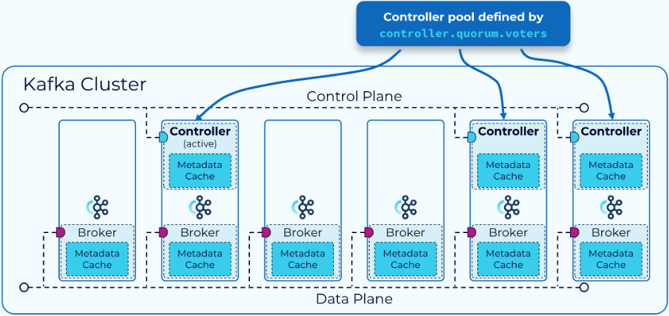
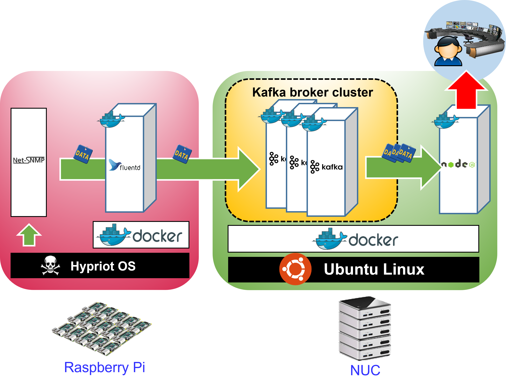

# Lab#2. InterConnect Lab

# 0. Objective

The main part of interConnect Lab is to connect one box with another box which connects computer systems in 2 ways. (Physical interconnect, Data interconnect)

- Physical Interconnect: Connection between boxes via the network.
- Data Interconnect: By using physical Interconnect, connect data between various functions.

# 1. Concept

## 1-1. Raspberry Pi


The Raspberry Pi (hereinafter referred to as Pi) is a small embedded computer designed by the Raspberry Pi Foundation. Compared to general-purpose computers, Pi is relatively inexpensive but has simplified hardware configurations and properties.

For example, the RTC (Real-Time Clock) is removed by default, requiring the time to be manually set after each boot. (Typically, `ntp` or `rdate` is used to synchronize the time.) Therefore, in this lab, we will configure the Pi to automatically set the time using rdate and crontab after booting.

In this lab, we will use the [Raspberry Pi 4 Model B](https://www.raspberrypi.com/products/raspberry-pi-4-model-b/). This model is powered via USB Type-C and can connect to a display using Micro-HDMI. Data storage is handled via a Micro SD card, meaning that the OS is installed by downloading it onto the SD card. The Pi supports both WiFi and Gigabit Ethernet for networking, but we will use Ethernet for this lab.

## 1-2. Apache Kafka


Apache Kafka, or Kafka is an open-source distributed event streaming platform capable of handling large-scale streaming data processing.

Streaming data refers to continuous and ongoing data generated from a data source. For example, a factory's temperature sensor continuously measures and transmits temperature data at regular intervals, while a CCTV system continuously sends captured video data. Such data is called streaming data.

Various systems continuously generate events, and multiple systems process these events. The process of extracting, transforming, processing, and delivering data from the source to its destination is defined as a data pipeline. Without a unified transmission method, diagnosing problems in a data pipeline requires checking all pipeline components, which increases the time needed for troubleshooting and system complexity. Additionally, different systems may use different data formats, making integration and expansion difficult.

Kafka was developed to address these issues by providing a unified transmission method that connects data sources and processing endpoints. Both data sources and processing systems only need to interact with Kafka, while administrators can centrally manage event and data flows through Kafka. This decouples data producers and consumers, allowing for easier expansion and increased reliability.



Kafka follows the publish-subscribe (Pub/Sub) pattern, which can be likened to the relationship between YouTubers and subscribers. Consumers subscribe to specific topics they are interested in, while producers publish messages to these topics. The Kafka broker then enables consumers to retrieve messages from the topics they have subscribed to.

Below table is summary of the key members of Apache Kafka.

| Name       | Description                                                                                             |
| ---------- | :------------------------------------------------------------------------------------------------------ |
| `Producer` | A component that creates events and sends them to Kafka.                                                |
| `Consumer` | A component that subscribes to topics and fetches events from Kafka for processing.                     |
| `Topics`   | The unit of event subscription. Similar to folders in a file system, it is used to store/manage events. |
| `Broker`   | A component that stores and manages events. It distributes and replicates events stored in topics.      |

Apache Kafka is commonly used as a Messaging System, but unlike traditional messaging queues, Events do not disappear immediately when a Consumer reads them, and it can be read as many times as needed. Instead, Kafka manages events by defining the event's lifetime for each Topic.

Topics are managed by being divided into multiple partitions. If a single topic were stored in one location, a large number of producers and consumers would simultaneously access that single point in a short period in large-scale environments. This could lead to system failures and, ultimately, service outages. Therefore, topics are distributed and stored across multiple brokers' "buckets" (storage spaces) for efficient management.

In some cases, topic partitions are replicated across multiple brokers for high availability and fault tolerance. A leader is elected for each partition to handle requests related to that partition.

However, operating Kafka as a distributed system introduces various challenges, such as broker management, data synchronization between nodes, failure detection and handling, metadata and configuration management, and leader election. This is where `Apache Zookeeper` plays a key role.

Zookeeper continuously communicates with brokers to monitor their status. It manages Kafka's state information (such as the number of topics, partitions, and replications) and metadata (such as broker locations and leader information). Zookeeper determines the leader for each partition, detects broker failures, and facilitates data recovery and leader re-election when a failure occurs. These functionalities enable Kafka to function as a large-scale distributed system.

In this Lab, we will see that data-interconnects can be achieved by confirming that Apache Kafka delivers Pi events to NUC's Consumer.

> [!warning]
>
> As of Apache Kafka 3.5, Zookeeper is deprecated and replaced by KRaft, which provides enhanced capabilities. While we use Zookeeper in this lab for compatibility purposes, it is recommended to use KRaft for future deployments.

<!-- -->

> [!tip]
> If you want to know more about Apache Kafka, Please refer to [Apache Kafka Docs](https://kafka.apache.org/documentation/#intro_concepts_and_terms).

## 1-3. Net-SNMP

[Net-SNMP](http://www.net-snmp.org/) is a suite of applications that allows for monitoring network devices, computers, and small devices using the SNMP protocol on Linux operating systems.

Simple Network Management Protocol (SNMP) is an L7 protocol used to manage and monitor devices connected to IP networks, such as routers, switches, and load balancers, from a central management system.


SNMP consists of the following key components:


| Component                        | Description                                                                                                                                                                                                                                                                                                      |
| -------------------------------- | ---------------------------------------------------------------------------------------------------------------------------------------------------------------------------------------------------------------------------------------------------------------------------------------------------------------- |
| SNMP Manager                     | Central system that monitors the network. Also known as the Network Management Station (NMS). SNMP Client in Host works as SNMP Manager.                                                                                                                                                                         |
| SNMP Agent                       | Collects, stores, and modifies system information in response to commands from the SNMP Manager. SNMP Server in Network device works as SNMP Agent.                                                                                                                                                              |
| Managed Device                   | A device with an SNMP agent installed that can be centrally managed via SNMP.                                                                                                                                                                                                                                    |
| MIB(Management Information Base) | stores network status information and settings of managed devices. consists of a total of eight categories (system, interface, address translation, IP, UDP, TCP, EGP, and ICMP). each MIB Object has unique OID(Object ID) (e.g. `1.3.6.1.2.1.2.2.1.16.2`: size of received bytes at the 2nd network interface) |

Net-SNMP is a suite of applications that allows for monitoring network devices, computers, and small devices using the SNMP protocol on Linux operating systems.

Net-SNMP includes tools that enable both SNMP Manager and SNMP Agent roles on Linux systems. It provides several CLI tools (`snmpget`, `snmptable`, ...) to send SNMP requests to agents, daemon applications (e.g., `snmpd`, ...) to act as SNMP agents, and additional libraries for further SNMP-related operations.


In this lab, we will install `snmpd` on the Pi and use Apache Flume to collect the Pi's network interface status and system information (such as available RAM, CPU load, and available disk space). In this setup, the Pi acts as the Managed Device, `snmpd` acts as the SNMP Agent, and Flume functions as the SNMP Manager.

> [!note]
> The system information to be collected is defined in the `flume-conf.properties` file under `agent.sources.sources1.oidN` during the Flume deployment.

<!-- -->

> [!tip]  
> For more details on SNMP, refer to [GeeksForGeeks](https://www.geeksforgeeks.org/simple-network-management-protocol-snmp/).

## 1-4. Apache Flume

Apache Flume is a distributed, reliable service designed for efficiently collecting, aggregating, and moving large volumes of log data.

Flume's data flow model consists of three main components:


| Component | Description                                                                                                                                                    |
| --------- | -------------------------------------------------------------------------------------------------------------------------------------------------------------- |
| Source    | Collects events from external systems. Event format must have to be recognized by Flume.                                                                       |
| Channel   | A passive store that temporarily holds events until they are retrieved by the sink. Event comes from the `Source`. e.g. File Channel (Local File System based) |
| Sink      | Retrieves events from the channel and sends them to an external storage system or agent.                                                                       |

In this lab, Flume will be used to gather system status data from `snmpd` via SNMP and send it to Kafka.

> [!warning]
>
> As of October 2024, Apache Flume is officially discontinued. Consider migrating to alternatives like Fluentd or Logstash for future distributed log collection, when you are planning to use, or using Apache Flume.  
> For now, we are using Flume for compatibility and lab purposes.

# 2. Practice



> [!note]
>
> If you encounter internet connectivity issues on the box despite a working gateway connection, update the DNS settings in /etc/resolv.conf as follows:
>
> ```bash
> sudo vim /etc/resolv.conf
> ```
>
> ```text
> ...
> # operation for /etc/resolv.conf
> nameserver 203.237.32.100
> ```
>
> After every boot, the content of `/etc/resolv.conf` is gone, you should do the above steps again.

## 2-1. Raspberry PI OS Installation

> [!warning]
>
> To prevent IP conflict, if VM and Docker Container are running, please turn off both.
>
> ```bash
> sudo docker stop <container_name>
> sudo killall -9 qemu-system-x86_64  # if can not kill it, use sudo killall -9 kvm
> ```

Now we will install HypriotOS on the Raspberry Pi. HypriotOS is a Debian-based operating system optimized for running Docker on Raspberry Pi. The OS is pre-configured with Docker and is optimized from the kernel to filesystem levels, for Docker. (For more details, please refer to [Hypriot Blog](https://blog.hypriot.com/about/#hypriotos:6083a88ee3411b0d17ce02d738f69d47).)

To install HypriotOS, insert the Micro SD card into a reader, and insert into the NUC.

> [!caution]
>
> **Please ensure that the Pi is <ins>completely powered off</ins>** before removing the SD card.
>
> Raspberry Pi uses SD card as a storage device.  
> If you remove it before power-off, Potential Data Corruption can occur, which causes critical, fatal error on operation.
>
> Therefore, please check whether Pi is completely powered off, and remove SD card safely.
>
> ```bash
> sudo poweroff
> ```
>
> 📰️️ Note: `sudo` is used to execute command as a `root`(admin). Only `root` can execute `poweroff`.

### 2-1-1. (NUC) Download Required Package and File

[`flash`](https://github.com/hypriot/flash) is a script that flash SD Card. We will use `flash` to install HypriotOS on SD Card. Please install `flash` following the guidance below.

```bash
sudo apt-get update && sudo apt-get install -y pv curl python3-pip unzip hdparm
sudo pip3 install awscli
curl -O https://raw.githubusercontent.com/hypriot/flash/master/flash
chmod +x flash
sudo mv flash /usr/local/bin/flash
```

<details>
<summary> 📰️ Note: Dependency of `flash` </summary>

For more information, please refer to <https://github.com/hypriot/flash>.

> |     Tool      | Description                               |
> | :-----------: | :---------------------------------------- |
> |     `pv`      | Showing progress bar.                     |
> |   `awscli`    | download image from AWS S3 Bucket         |
> | `python3-pip` | to install/execute `awscli`               |
> |    `curl`     | download image from web server, using URL |
> |    `unzip`    | unzip compressed image.                   |
> |   `hdparm`    | use to flash SD Card images               |

</details>

<details>
<summary> Package Version (Refer this when dependency error occurs) (Expand)</summary>

#### NUC flash dependencies

|   Package   |      Version       |
| :---------: | :----------------: |
|     pv      |      1.6.6-1       |
|    curl     | 7.68.0-1ubuntu2.15 |
| python3-pip | 20.0.2-5ubuntu1.7  |
|    unzip    |  6.0-25ubuntu1.1   |
|   hdparm    |     9.58+ds-4      |

#### Python flash dependencies

| Package | Version |
| :-----: | :-----: |
| awscli  | 1.27.59 |

</details>

`flash` delivers configuration files to `cloud-init`, to configure Network, create user account, and SSH, etc. To download pre-configured files, We will clone Github Repository.

Since there are some large files, first we will add `git-lfs`, then clone repository, at last move to next working directory. Please follow guidance below.

```bash
cd ~
sudo apt install -y git
curl -s https://packagecloud.io/install/repositories/github/git-lfs/script.deb.sh | sudo bash
sudo apt install -y git-lfs
git lfs install
git clone https://github.com/SmartX-Labs/SmartX-Mini.git
cd ~/SmartX-Mini/SmartX-Mini-2025/Experiment/Lab-2.\ InterConnect/
```

<details>
<summary>Package Versions (Expand)</summary>

#### NUC git-lfs package versions

| Package |       Version       |
| :-----: | :-----------------: |
|   git   | 1:2.25.1-1ubuntu3.8 |
| git-lfs |        3.3.0        |

</details>

Next, download HypriotOS(v1.12.3) image file.

```bash
wget https://github.com/hypriot/image-builder-rpi/releases/download/v1.12.3/hypriotos-rpi-v1.12.3.img.zip
ls -alh # Check all files
```

### 2-1-2. (NUC) Edit Configuration of HypriotOS

`network-config` file is used to configure network setting. Now we will open and edit this file to configure.

> [!caution]
>
> **<ins>Do not change the name</ins> of `network-config` file.**  
> `network-config` is the pre-defined file name, which is used by `cloud-init` to configure network setting during booting. (HypriotOS is managed by `cloud-init`)  
> So, `cloud-init` always try to find `network-config` file at the root directory of local file system mainly. (You can figure out where is root directory, by executing `lsblk` or something.)
>
> `flash` will copy it to `/boot`(actually boot partition) of SD Card, but file name does not be changed.
>
> If you change the name of `network-config`, then `cloud-init` cannot find that file, which results in failure of network configuration. (i.e. default network setting will be applied.) In that case, you should re-install OS or manually configure network setting.
>
> So, warning again, <ins>**Do not change the file name.**</ins>
>
> REF: <https://cloudinit.readthedocs.io/en/stable/reference/datasources/nocloud.html#source-files>

<!-- -->

> [!note]
>
> Topic: What is `cloud-init`, and How it initializes the OS
>
> `cloud-init` is a tool used to initialize cloud instances. It is widely utilized by public cloud providers such as AWS and Google Cloud, as well as for provisioning private cloud infrastructure and installing bare-metal systems.
>
> During the boot sequence, `cloud-init` performs initialization in two main phases: Early-boot and Late-boot.
>
> In the **Early-boot** phase, it identifies the data source and applies configuration settings, including network configuration. First, it identifies the data source required for instance initialization based on system defaults. (The data source is the location containing the configuration information needed for instance initialization.) For public cloud providers, this data source is usually provided by an external server. For bare-metal systems (referred to as `NoCloud`), cloud-init searches for configuration files within the root directories of the local file system, such as `/` or `/boot` (these directories can be identified using the `lsblk` command).
>
> After identifying the data source, cloud-init retrieves multiple configuration files from it. It uses `meta-data` to identify instance-specific information such as the Instance ID and platform details. Through `user-data` (or `vendor-data` for public clouds), it applies configuration settings, including hardware optimizations, hostname assignments, the management of various configuration files, default user account setup, and user-defined script execution. Additionally, the `network-config` file provides the network interface settings.
>
> In the **Late-boot** phase, `cloud-init` handles tasks that are less critical for the initial boot. This phase typically uses values defined in the `user-data` or `vendor-data` files.
>
> During this phase, tools like `Ansible` or `Chef` can be used to perform fine-grained system configurations. It may also download essential software for system operation, create and configure user accounts, and execute various scripts as specified in `user-data` or `vendor-data`.
>
> Once these processes are complete, the system is fully initialized and ready for user access.
>
> REF1: <https://cloudinit.readthedocs.io/en/latest/explanation/introduction.html>  
> REF2: <https://cloudinit.readthedocs.io/en/stable/reference/datasources/nocloud.html>

```bash
pwd # check working directory is "SmartX-Mini/SmartX-Mini-2025/Experiment/Lab-2. InterConnect/"
sudo vim network-config
```

In the `network-config` file, `ethernet.eth0` represents the configuration for the Pi's `eth0` interface. This section specifies the IP address, DNS address, and gateway address for the Pi.

We will modify the `ethernet.eth0.addresses` field to assign an IP address to the Pi and adjust `ethernet.eth0.nameservers.addresses` to specify the DNS server. (The `ethernet.eth0.gateway4` field defines the IPv4 gateway, which should remain unchanged unless explicitly instructed.)

```yaml
…
    addresses:
      - 172.29.0.xxx/24 # change xxx to your pi address!
    gateway4: 172.29.0.254
    nameservers:
      addresses: [203.237.32.100, 203.237.32.101] # write your DNS servers
…
```

These network settings will be automatically applied during the Pi's boot process through `cloud-init`.

### 2-1-3. (NUC) Flash SD Card for HypriotOS Install

To install HypriotOS onto the SD card, we first need to identify where the SD card is mounted. We will use the `fdisk` command to locate a partition that matches the SD card's size.

SD cards are typically mounted under paths starting with `/dev/sd`. For a 32GB SD card, the size will be displayed as approximately 29.8 GiB, while a 16GB card will appear as approximately 14.6 GiB. Identify the corresponding device path based on these values. (In the image below, the SD card is mounted at `/dev/sdc`.)

```bash
sudo fdisk -l
```


Once identified, use the following command to install HypriotOS onto the SD card. Wait until the process is complete and verify that the "Finished" message is displayed. If the process terminates prematurely or this message does not appear, the installation may not have been successfully applied.

```bash
flash -u hypriotos-init.yaml -F network-config -d <Your SD Card Directory> hypriotos-rpi-v1.12.3.img.zip
```

> [!tip]
>
> Table below describes options for `flash`. Details are shown by `flash --help`.
>
> | Options                          | Description                                                  |
> | :------------------------------- | :----------------------------------------------------------- |
> | `-u <file>`, `--userdata <file>` | select file which will be copied to `/boot/user-data` of OS. |
> | `-F <file>`, `--file <file>`     | select file which will be copied to `/boot` of OS.           |
> | `-d <path>`, `--device`          | Path of Device which where OS be installed.                  |
> | `~.img`, `~.img.zip`             | Raspberry OS Image File                                      |

<!-- -->

> [!note]
>
> Topic: How to resolve `BLKRRPART failed: Device or resource busy` error
>
> If this error occurs, the OS is installed successfully, but the `hypriotos-init.yaml` and `network-config` files are not copied to the SD card.
>
> Try the following steps one by one to resolve the error:
> **<ins>If you do not encounter this error, Do not apply those steps.</ins>**
>
> 1. If the SD card is mounted at `/dev/sda`, manually copy `hypriotos-init.yaml` as `user-data` to `/dev/sda1` and also copy `network-config` to the same location. Perform the following commands to do this:
>
>    ```bash
>    # Open terminal in NUC
>    sudo mkdir /mnt/sdcard
>    sudo mount /dev/sda1 /mnt/sdcard
>    sudo cp hypriotos-init.yaml /mnt/sdcard/user-data
>    sudo cp network-config /mnt/sdcard/network-config
>    sudo umount /mnt/sdcard
>    sudo eject /dev/sda
>    # remove SD card from NUC
>    ```
>
>    Then, eject the SD card from the NUC, insert it into the Pi, and power on the Pi. Verify that the network and hostname settings are correctly applied, by following `2-2-1`. if configuration is not applied, then move to step 2.
>
> 2. Run the `flash -u hypriotos-init.yaml -F network-config -d <Your SD Card Directory> hypriotos-rpi-v1.12.3.img.zip` command again to reinstall HypriotOS. Sometimes temporary error can be occurred.
> 3. Delete all partitions on the SD card and try the `flash -u hypriotos-init.yaml -F network-config -d <Your SD Card Directory> hypriotos-rpi-v1.12.3.img.zip` again. You can delete the partitions using the following commands:
>
>    ```bash
>    sudo umount <sd_card_path>
>    sudo fdisk <sd_card_path>
>    d   # enter this repetitively unless every partitions are removed.
>    w   # save changes
>    ```

<!-- -->

> [!note]
>
> Topic: About the `hypriotos-init.yaml` file
>
> The `hypriotos-init.yaml` file is used as the `/boot/user-data` file on HypriotOS.  
> The `/boot/user-data` file provides user-defined configurations to the instance during initialization. It defines user creation, hostname settings, and whether to automatically initialize `/etc/hosts`.  
> This file also contains the initial user credentials, so if you forget the ID/PW, refer to this file.
>
> REF: <https://cloudinit.readthedocs.io/en/stable/explanation/format.html>

## 2-2. Raspberry PI Environment Setup

### 2-2-1. (PI) Check Network Configuration

Now, eject the SD card, insert it into the Pi, and power it on. The default login credentials are (ID: `pi`, Password: `1234`).

Next, connect a keyboard, and monitor to the **Pi** to proceed with the setup.

First, verify that the network interface is configured correctly by entering the following command in the shell:

```bash
ifconfig
```

Next, check the routing table using the following command:

```bash
netstat -rn
```

### 2-2-2. (PI) Install Package

To proceed with the lab, install the following packages on the Pi:

```bash
sudo apt update
sudo apt install -y git vim rdate openssh-server
```

|     Package      | Description                                                   |
| :--------------: | ------------------------------------------------------------- |
|      `git`       | Git CLI tool                                                  |
|      `vim`       | Text editor                                                   |
|     `rdate`      | Tool to synchronize system time with an external time server. |
| `openssh-server` | Package to enable SSH server functionality on the Pi.         |

<!-- TODO: mismatch with korean version -->

Once the package installation is complete, <ins>**return to the NUC**</ins>. Ensure that the <ins>**Pi remains powered on**</ins>, as you will access it via SSH from the NUC.

> [!note]
>
> Topic: Resolving `Certificate verification failed: The certificate is NOT Trusted` error
>
> If you encounter certificate verification errors while installing packages due to a repository issue, you need to switch to another APT repository.
>
> To modify the APT repository, open the /etc/apt/sources.list file using an editor (e.g., nano or vi):
>
> ```bash
> sudo nano /etc/apt/sources.list
> ```
>
> Replace the URL in the first line (e.g., <http://ftp.lanet.kr/raspbian/>) with an alternative mirror, such as <http://ftp.kaist.ac.kr/raspbian/raspbian/>.
>
> Save the changes and retry the package installation process.

<details>
<summary>Package Versions (Expand)</summary>

#### PI initial dependencies

|    Package     |         Version         |
| :------------: | :---------------------: |
|      git       |   1:2.20.1-2+deb10u7    |
|      vim       |  2:8.1.0875-5+deb10u4   |
|     rdate      |         1:1.2-6         |
| openssh-server | 1:7.9p1-10+deb10u2+rpt1 |

</details>

### 2-2-3. (PI) Configuring `crontab` for Time Synchronization

Since the Raspberry Pi lacks an RTC (Real-Time Clock), it can only maintain system time for about 17 minutes after being powered off.  
To synchronize the system time after booting, we will configure `crontab` to execute the `rdate` command 1 minute after the boot process is complete.

First, modify the `crontab` settings using the following command:

```bash
sudo crontab -e
```

If this is your first time editing crontab, you will be prompted to select a text editor.  
Choose your preferred editor and add the following line to the bottom of the configuration file (excluding comments):


```bash
# Run `rdate' to synchronize the time 60 seconds after boot
@reboot sleep 60 && rdate -s time.bora.net
```

<!-- 시각이 맞춰지는데 60초 정도 걸리기 때문에 별로 쓰고 싶지는 않았는데, 부팅 마지막에 실행되는 `rc.local` 의 경우, After=network-online.target(네트워크가 다 켜진 다음 rc.local 실행)을 지정해도 DNS 에러가 뜨고(부팅 후에 같은 커맨드 쓰면 안 뜸), crontab 같은 경우에도 저 60초 정도 기다리지 않으면 DNS 에러가 발생했습니다. 60초는 짧긴 하지만 그래도 이 사이에 시계가 정확해야 하는 일 실행해서 오류가 난다면 아래 수동으로 시간 맞추는 커맨드를 입력하라 합시다.-->

Save the changes and restart the Pi using the following command:

```bash
sudo reboot
```

### 2-2-4. (NUC) Check Pi Setup

Since `openssh-server` has been installed on the Pi, you can now access the Pi via SSH from external devices.  
(From now on, there's no need to repetitively unplug and plug in the monitor, and keyboard. You can access the Pi via SSH from the NUC.)

To verify this, I will access the Pi via SSH from the terminal on the NUC.  
Return to the NUC and enter the following command:

```bash
ssh pi@<PI_IP>  # Simple Format: ssh <ID>@<destination IP or Hostname>
```

> [!note]
>
> Topic: SSH - Fingerprint Error
>
> 
>
> This error occurs when the SSH key associated with the target IP address differs from the key of the SSH server you are trying to access. (e.g. re-install `openssh-server`)
>
> Each SSH server has a unique SSH key.  
> When an SSH client connects to a server, the server's key is shared with the client, which then stores the key and IP address in the `~/.ssh/known_hosts` file.  
> (The image below illustrates this process.)
>
> 
>
> When the client try to reconnects to the server, it uses the stored key in `~/.ssh/known_hosts` to verify that the server is the same one previously accessed. This mechanism helps prevent man-in-the-middle attacks.  
> If the SSH key of the server has changed, verification will be failed and `ssh` will produce an error and terminate the connection.
>
> To resolve this error, remove the previous fingerprint using the following command and then try reconnecting via SSH:
>
> ```bash
> ssh-keygen -f "/home/$(whoami)/.ssh/known_hosts" -R "<PI_IP_ADDRESS>"
> ```

Next, please check the system time by entering a commend below:

```bash
date
```

If the system time is still incorrect after rebooting, you can manually synchronize it using the command below:

```bash
sudo rdate -s time.bora.net
```

## 2-3. Hostname Configuration

Every device connected to a network is identified and communicates using a unique IP address.

However, remembering IP addresses is impractical, especially in environments where IPs change dynamically due to DHCP, cloud infrastructure, or Kubernetes pods and services. This makes direct communication using IP addresses inconvenient and inefficient.

To address this, devices are typically assigned "hostnames"—user-friendly names for easier communication. Similar to how a URL is resolved to an IP address through DNS, the `/etc/hosts` file on the Pi allows the OS to map hostnames to IP addresses.

For example, if the Pi tries to access NUC using hostname `nuc`, the OS will reference the `/etc/hosts` file and translate `nuc` to the actual IP address of the NUC. This allows the Pi to interact with the NUC using the hostname instead of the IP address.

In short, the `/etc/hosts` file links hostnames to actual IP addresses. Even if a service's IP address changes, updating the corresponding entry in `/etc/hosts` ensures uninterrupted communication.

Subsequent steps in the lab will also use hostnames rather than IP addresses for interaction.

### 2-3-1. (NUC) Hostname preparation for Kafka

First, check the hostname of the NUC using the following command:

```bash
hostname
```

Next, open the `/etc/hosts` file using a text editor.

```bash
sudo vim /etc/hosts
```

Add the following line(Pi IP Address & Hostname) at the bottom of the file:

<!--
  Pi IP만 적는 것으로 수정합니다.
  REF: Issue #98
-->

```text
172.29.0.XX        <PI_HOSTNAME>
```

> [!Caution]
>
> The hostnames of the Pi and NUC entered in `/etc/hosts` <ins>**must match their actual hostnames.**</ins>
>
> If they do not match, issues may arise during the upcoming Kafka practice sessions.

<!-- -->

> [!note]
>
> Topic: How to change Hostname (⚠️Warning⚠️: Applying this during lab is <ins>**not recommended.**</ins>)
>
> You can change the NUC's hostname using the following commands:
>
> **Temporary change (reverts after reboot):**
>
> ```bash
> sudo hostname <new_name>
> ```
>
> **Permanent change:**
>
> ```bash
> # Change Permanently
> sudo hostnamectl set-hostname <new_name>
> ```
>
> After changing the hostname, ensure you update the NUC's hostname entry in the `/etc/hosts` file.
>
> On the Pi, additional steps are required for permanent changes due to `cloud-init`  
> For more details, refer to: <https://repost.aws/ko/knowledge-center/linux-static-hostname-rhel7-centos7>

### 2-3-2. (PI) Hostname preparation for Kafka

Perform the same steps on the Pi that were done on the NUC in section 2-3-1. Open the `/etc/hosts` file and add the following line(NUC IP Address & Hostname).

```bash
sudo vim /etc/hosts
```

<!--
  NUC IP만 적는 것으로 수정합니다.
  REF: Issue #98
-->

```text
172.29.0.XX        <NUC_HOSTNAME>
```

> [!warning]
>
> The `/etc/hosts` file on the Pi is reset during boot due to cloud-init.  
> If you want to preserve these settings after reboot, follow the guidelines below.

<!-- -->

> [!tip]
>
> Topic: How to Preserve `/etc/hosts` on the Pi
>
> cloud-init regenerates the /etc/hosts file during boot using a predefined hosts template.  
> Any manual modifications will be overwritten.
>
> To make permanent changes, you can use one of the following three methods:
>
> 1. Modify the `manage_etc_hosts` value to `false` in the `hypriotos-init.yaml` file used during OS installation and reinstall the OS.
> 2. Edit the `/etc/cloud/templates/hosts.debian.tmpl` file on the Pi with the same modifications made to `/etc/hosts`.
> 3. Comment out the `update_etc_hosts` module in `/etc/cloud/cloud.cfg`. This module is responsible for regenerating `/etc/hosts`.

<!-- 2025.02.27: 이유는 모르겠지만 HypriotOS 내부에서 /boot/user-data를 직접 수정해도 Data가 날아감. 아마 cloud-init을 제대로 이해하지 못했기 때문이라고 생각한다. 추후에 근본 원인을 찾아낸다면 수정을 부탁한다. -->

### 2-3-3. (PI, NUC) Verifying Hostname-based Communication

From the NUC, verify that hostname-based communication is working correctly:

```bash
sudo ping <Your NUC hostname>
sudo ping <Your Raspberry PI hostname>
```

From the Pi, perform the same verification:

```bash
sudo ping <Your NUC hostname>
sudo ping <Your Raspberry PI hostname>
```

Successful communication should display ICMP packet responses. If you encounter errors like "Non-Reachable," check the network configuration and `/etc/hosts` entries on both devices. Similar output should be visible on both the Pi and the NUC.


## 2-4. (NUC) Kafka Deployment

Now that the Pi and NUC can communicate via their hostnames, we will deploy Apache Kafka on the NUC using Docker to enable message exchange between the devices. This corresponds to the "Data Interconnect" portion of the lab.

We will deploy 1 Zookeeper, 3 Brokers, and 1 Consumer as Docker containers on the NUC. These containers will share the NUC's public IP address.  
Zookeeper does not require a Broker ID, while each Kafka broker will be assigned IDs 0, 1, and 2. The consumer will only be used for managing topics and collecting data.

| Function(container) Name | IP Address | Broker ID | Listening Port |
| :----------------------: | :--------: | :-------: | :------------: |
|        zookeeper         | Host's IP  |     -     |      2181      |
|         broker0          | Host's IP  |     0     |      9090      |
|         broker1          | Host's IP  |     1     |      9091      |
|         broker2          | Host's IP  |     2     |      9092      |
|         consumer         | Host's IP  |     -     |       -        |

### 2-4-1. (NUC) Check Dockerfile

First, we will build the Docker image required to create the containers.  
We will use the `ubuntu-kafka` directory to build the image.  
Navigate to this directory using the command below.

```bash
cd ~/SmartX-Mini/SmartX-Box/ubuntu-kafka
```

Check that the `Dockerfile` in the current directory matches the expected contents.

```dockerfile
FROM ubuntu:14.04
LABEL "maintainer"="Seungryong Kim <srkim@nm.gist.ac.kr>"

RUN sed -i 's@archive.ubuntu.com@mirror.kakao.com@g' /etc/apt/sources.list

#Update & Install wget
RUN sudo apt-get update
RUN sudo apt-get install -y wget vim iputils-ping net-tools iproute2 dnsutils openjdk-7-jdk

#Install Kafka
RUN sudo wget --no-check-certificate https://archive.apache.org/dist/kafka/0.8.2.0/kafka_2.10-0.8.2.0.tgz -O - | tar -zxv
RUN sudo mv kafka_2.10-0.8.2.0 /kafka
WORKDIR /kafka
```

> [!tip]
>
> Note: Modifying the APT Repository (Optional)
>
> Downloading packages via `apt` during the image build process can be slow.
>
> To speed up the build, consider updating the APT repository to a mirror server by changing the following `sed` command.
>
> ```dockerfile
> …
>
> RUN sed -i 's@archive.ubuntu.com@mirror.kakao.com@g' /etc/apt/sources.list
> #Update & Install wget
> RUN sudo apt-get update
> RUN sudo apt-get install -y wget vim iputils-ping net-tools iproute2 dnsutils openjdk-7-jdk
> …
> ```

### 2-4-2. (NUC) Build Docker Image

Once you have verified the `Dockerfile`, proceed to build the Docker image using the following command:

```bash
sudo docker build --tag ubuntu-kafka .
#You should type '.', so docker can automatically start to find `Dockerfile` in the current directory('.').
```

> [!tip]
>
> Note: Basic Docker CLI Commands
>
> The following are common Docker CLI commands that you can use to manage containers:
>
> For more information, Please refer to [Docker Official Document](https://docs.docker.com/engine/reference/commandline/cli/).
>
> | Command                             | Description                                                 |
> | ----------------------------------- | ----------------------------------------------------------- |
> | `sudo docker --help`                | Displays available Docker CLI commands and options.         |
> | `sudo docker ps`                    | Lists running containers. Use `-a` to include stopped ones. |
> | `sudo docker rm <container_id>`     | Removes a Docker container.                                 |
> | `sudo docker start <container_id>`  | Starts a stopped Docker container.                          |
> | `sudo docker stop <container_id>`   | Stops a running Docker container.                           |
> | `sudo docker attach <container_id>` | Attaches to a running Docker container.                     |
> | `sudo docker run <options> <image>` | Creates and starts a container from the specified image.    |
>
> You can use the first 4 characters of the container ID shown by `docker ps` as `<container id>`, as long as they are unique.

### 2-4-3. (NUC) Deploy Docker Containers

Once the `ubuntu-kafka` image is built, create and run the following Docker containers: `zookeeper`, `broker0`, `broker1`, `broker2`, `consumer`.

Open five terminal windows on the NUC. Each terminal will attach to one Docker container.

```bash
# Terminal #1
sudo docker run -it --net=host --name zookeeper ubuntu-kafka
# Terminal #2
sudo docker run -it --net=host --name broker0 ubuntu-kafka
# Terminal #3
sudo docker run -it --net=host --name broker1 ubuntu-kafka
# Terminal #4
sudo docker run -it --net=host --name broker2 ubuntu-kafka
# Terminal #5
sudo docker run -it --net=host --name consumer ubuntu-kafka
```

### 2-4-4. (NUC - `zookeeper` Container) Configure Zookeeper

First, access the `zookeeper` container to configure it.  
Use the following command to check the `zookeeper.properties` file:

```bash
sudo vim config/zookeeper.properties
```

Ensure that the Client Port is set to `2181`. If not, modify the file to reflect this value:

Next, start the Zookeeper service using the command below:

```bash
bin/zookeeper-server-start.sh config/zookeeper.properties
```

> [!warning]
>
> Zookeeper must always be started before Kafka brokers. Ensure this order is maintained when reconfiguring the environment.

### 2-4-5. (NUC - `brokerN` Container) Broker Configuration

Next, access each broker container to configure them. Open the configuration file using the following command:

```bash
sudo vim config/server.properties
```

Refer to the table below and ensure each broker is set with unique values for Broker ID and Listening Port:

| Function(container) Name | IP Address | Broker ID | Listening Port |
| :----------------------: | :--------: | :-------: | :------------: |
|         broker0          | Host's IP  |     0     |      9090      |
|         broker1          | Host's IP  |     1     |      9091      |
|         broker2          | Host's IP  |     2     |      9092      |


After configuring each broker, start the Kafka brokers using the following command in their respective containers:

```bash
bin/kafka-server-start.sh config/server.properties
```

### 2-4-6. (NUC - `consumer` Container) Consumer Topic Setup

Access the `consumer` container to create a resource topic in Kafka.  
Use the following command to create the topic:

```bash
bin/kafka-topics.sh --create --zookeeper localhost:2181 --replication-factor 1 --partitions 3 --topic resource
```

To verify that the topic has been successfully created, run:

```bash
bin/kafka-topics.sh --list --zookeeper localhost:2181 # list all topic of zookeeper in localhost:2181
bin/kafka-topics.sh --describe --zookeeper localhost:2181 --topic resource # Check existence of topic `resource` of zookeeper in localhost:2181
```

## 2-5. (PI) Flume on Raspberry PI

### 2-5-1. (PI) Install Net-SNMP installation

Return to the Pi and install the `Net-SNMP` package using the following command:

```bash
sudo apt update
sudo apt install -y snmp snmpd snmp-mibs-downloader openjdk-8-jdk
```

<details>
<summary>Package Versions (Expand)</summary>

#### PI snmp dependencies

|       Package        |       Version        |
| :------------------: | :------------------: |
|         snmp         | 5.7.3+dfsg-5+deb10u4 |
|        snmpd         | 5.7.3+dfsg-5+deb10u4 |
| snmp-mibs-downloader |         1.2          |
|    openjdk-8-jdk     |  8u312-b07-1~deb9u1  |

</details>

Next, open the SNMP daemon configuration file, find `#rocommunity public localhost`, and remove `#`.

```bash
sudo vim /etc/snmp/snmpd.conf
```

Restart the `snmpd.service` to apply the changes:

```bash
sudo systemctl restart snmpd.service
```

### 2-5-2. (PI) Clone repository from GitHub

Clone the `SmartX-mini` repository on the Pi:

```bash
cd ~
git clone https://github.com/SmartX-Labs/SmartX-Mini.git
```

Navigate to the `raspbian-flume` directory where we will deploy Flume:

```bash
cd ~/SmartX-Mini/SmartX-Box/raspbian-flume
```

### 2-5-3. Check Dockerfile

Open the `Dockerfile` and ensure the contents match the following configuration:

> [!caution]
>
> Ensure the base image is set to `FROM balenalib/rpi-raspbian:buster`, not `stretch`.
>
> If base image is `stretch`, you may encounter the build failure.

```dockerfile
FROM balenalib/rpi-raspbian:buster
LABEL "maintainer"="Seungryong Kim <srkim@nm.gist.ac.kr>"

RUN sed -i 's@archive.raspbian.org@legacy.raspbian.org@g' /etc/apt/sources.list

#Update & Install wget, vim
RUN sudo apt update
RUN sudo apt install -y wget vim iputils-ping net-tools iproute2 dnsutils openjdk-8-jdk

#Timezone
RUN sudo cp /usr/share/zoneinfo/Asia/Seoul /etc/localtime

#Install Flume
RUN sudo wget --no-check-certificate http://archive.apache.org/dist/flume/1.6.0/apache-flume-1.6.0-bin.tar.gz -O - | tar -zxv
RUN mv apache-flume-1.6.0-bin /flume
ADD plugins.d /flume/plugins.d
ADD flume-conf.properties /flume/conf/

#Working directory
WORKDIR /flume
```

### 2-5-4. (PI) Build docker image

Once the configuration is complete, build the Docker image for Flume. Note that this process will take longer than on the NUC:

```bash
sudo docker build --tag raspbian-flume .
```

### 2-5-5. Run flume on container

After successfully building the Docker image, create and run the `flume` container.

```bash
sudo docker run -it --net=host --name flume raspbian-flume
```

First, open the `flume` configuration file:

```bash
sudo vim conf/flume-conf.properties
```

Locate the `brokerList` entry and update the hostname to the value you used for the NUC in the Pi's `/etc/hosts` file.

```text
...
agent.sinks.sink1.brokerList = <Your NUC hostname>:9090,<Your NUC hostname>:9091,<Your NUC hostname>:9092
...
```

Start the Flume agent using the following command:

```bash
bin/flume-ng agent --conf conf --conf-file conf/flume-conf.properties --name agent -Dflume.root.logger=INFO,console
```

> [!note]
>
> If errors occur, verify that the following three values are consistent:
>
> 1. The NUC hostname in the Pi's `/etc/hosts` file.
> 2. The broker hostname in `conf/flume-conf.properties` on the Pi.
> 3. The hostname of NUC (check with the `hostname` command).

## 2-6. (NUC - `consumer` Container) Consume message from brokers

Run the following script to check whether the Consumer container can receive messages sent by the Producer.

```bash
bin/kafka-console-consumer.sh --zookeeper localhost:2181 --topic resource --from-beginning
```

If everything is configured correctly, you should see the message displayed in the `consumer` container.


> [!note]
>
> If `snmpd` is well-configured, and no error is shown on `producer`, but you can see any logs on `consumer`, Please remove and re-build the image `raspbian-flume` in Pi. Sometimes docker reports build process completed without error, yet unknown error has occurred on build process.
>
> To remove and rebuild the image, enter commands below on the Pi:
>
> ```bash
> sudo docker ps -a # list every created containers.
>
> # If there are some containers built using `raspbian-flume` image, then stop and remove them.
> sudo docker stop <flume-container> # stop container
> sudo docker rm <flume-container>   # remove container
>
> sudo docker rmi raspbian-flume     # remove image
> cd ~/SmartX-Mini/SmartX-Box/raspbian-flume    # move to `raspbian-flume` dir.
> sudo docker build --tag raspbian-flume .   # build `raspbian-flume` image
> ```

# 3. Review

## 3-1. Lab Summary

In this lab, we experienced interconnecting computer systems in two different ways.

Through steps `2-1` to `2-3`, you prepared for the physical interconnection of two computer systems and ultimately verified their ability to communicate with each other using `ping`. Through this process, we explored and experienced the concept of <ins>**Physical Interconnect**</ins>.

Afterward, multiple containers were deployed on the Box using Docker. In summary, from steps `2-4` to `2-6`, we confirmed that the SNMP data extracted by `Apache Flume` was transmitted through `Apache Kafka` and delivered to the Consumer. Through this, we verified that two functions (Producer ↔ Consumer) could interact and exchange data via Apache Kafka, allowing us to experience <ins>**Data Interconnect**</ins>.

## 3-2. Finale

Through this lab, we have answered the following two key questions:

1. How can heterogeneous devices (e.g., NUC and Pi) be physically interconnected?
2. How can we establish data transfer between two functions located on different devices (in this case, using Kafka messaging)?

By addressing these questions, you should now have a clear understanding of the difference between Physical Interconnect and Data Interconnect.

> [!important]
> Thank you for your effort and participation in this lab.  
> We appreciate your dedication!
