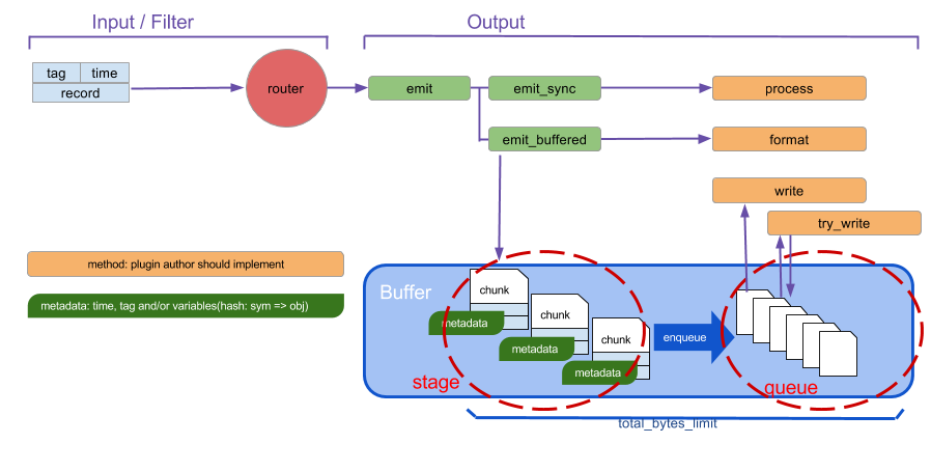

# Lab#2. InterConnect Lab

# 0. Objective

이번 InterConnect Lab에서는 2가지 방식을 통해 컴퓨터 시스템을 서로 연결해 볼 것입니다.

- Physical Interconnect: Network를 통해 물리적으로 두 Box를 연결합니다.
- Data Interconnect: Physical Interconnect를 이용하여, 두 Function 사이의 데이터를 연결합니다.

# 1. Concept

## 1-1. Raspberry Pi


라즈베리 파이(Raspberry Pi; 이하 Pi)는 Raspberry Pi 재단에서 디자인한 소형 임베디드 컴퓨터입니다. Pi는 일반적인 컴퓨터에 비해 비교적 저렴한 가격대로 구할 수 있지만, 그만큼 간소화된 하드웨어 구성과 특성(Property)을 갖습니다.

일례로 RTC(Real-Time Clock)가 기본적으로 제거되어있어, 부팅할 때마다 시간을 직접 맞춰주어야 합니다. (보통 `ntp`, `rdate`을 활용하여 부팅 시 시간을 조정할 수 있도록 설정합니다.) 이러한 이유로 본 실습에서는 Pi가 `rdate`와 `crontab`을 이용하여 부팅 이후 자동으로 시간을 맞출 수 있도록 설정합니다.

이번 실습에서는 [Raspberry Pi 4 Model B](https://www.raspberrypi.com/products/raspberry-pi-4-model-b/)를 사용합니다. 해당 모델은 USB Type-C를 통해 전원을 공급받으며, Micro-HDMI를 통해 화면과 연결할 수 있습니다. 데이터 저장은 Micro SD를 이용하기 때문에, OS 설치는 SD 카드에 OS를 다운로드하는 방식으로 이루어집니다. 네트워크는 WiFi와 Gigabit Ethernet을 제공하는데, 이번 실습에서는 Ethernet을 통해 네트워크와 연결합니다.

## 1-2. Apache Kafka


Apache Kafka(이하 Kafka)는 대규모 스트리밍 데이터 처리에 능한 오픈소스 분산 이벤트 스트리밍 플랫폼입니다.

여기서 스트리밍 데이터(Streaming Data)는 데이터 원천(Data Source)으로부터 연속적이고 지속적으로 생성되는 데이터를 의미합니다. 가령, 공장의 온도 센서는 매 주기마다 온도를 측정하여 끊임없이 전송하고, CCTV는 촬영한 영상을 끊임없이 전송합니다. 이러한 데이터를 스트리밍 데이터라고 부릅니다.

이와 같이 여러 시스템에서는 매 순간, 지속적으로 Event가 발생하며, 이를 받아 처리하는 시스템 또한 여럿 존재합니다. 여기서 데이터 원천에서 데이터를 가져와 변형하고, 처리하고, 최종 목적지에 전달하는 일련의 과정을 데이터 파이프라인(Data Pipeline)이라고 정의하겠습니다. 만약 데이터 파이프라인이 통일된 전송 수단 없이 구성된다면 어떤 문제가 발생할까요? 문제 파악을 위해 모든 파이프라인을 점검해야 하며, 이에 따라 장애 조치에 오랜 시간이 소요됩니다. 즉, 시스템 복잡도가 상승합니다. 또한, 각 처리 시스템마다 선호하는 데이터 포맷이 다르기에, 각 파이프라인마다 사용하는 데이터 포맷이 서로 달라 통합 및 확장이 까다로워집니다. 즉, 데이터 파이프라인을 관리하기 어려워집니다. 이러한 단점을 가장 잘 표현하는 것이 상단의 좌측 이미지입니다. (Apache Kafka 도입 이전의 LinkedIn의 데이터 처리 구성도입니다.)

이러한 목적으로 데이터 원천과 처리 지점을 연결하는 통합 전송 수단이 요구되었고, 이러한 수단으로 활용될 수 있는 도구가 Apache Kafka입니다. 데이터 원천과 데이터 처리 지점은 오로지 Kafka만 신경쓰면 되고, 관리자 또한 Kafka를 통해 모든 이벤트와 데이터의 흐름을 중앙 관리할 수 있습니다. 개발자 입장에서는 데이터 원천과 서비스 간의 연결을 신경쓰지 않아도 됩니다. (즉, 데이터 원천과 처리 지점을 Decoupling할 수 있습니다.) 또한 새로운 서비스와 시스템을 추가한다고 해도, Kafka 표준 포맷으로만 연결하면 되기에 확장이 용이하며 신뢰성이 상승합니다.


Apache Kafka는 구독-발행 패턴(Pub/Sub Pattern, Publish/Subscribe Pattern)을 따릅니다. 여기서 구독-발행 패턴은 유튜버와 구독자의 관계로 비유할 수 있습니다. 구독자는 유튜브에서 자신이 원하는 채널을 구독하고, 유튜버는 자신이 촬영한 영상을 유튜브에 업로드합니다. 그러면 구독자는 구독 목록을 보고 원하는 영상을 볼 수 있게 됩니다. 마찬가지로, Consumer가 자신이 원하는 Topic을 구독하고, Producer가 Topic에 메세지를 등록하면 Broker를 통해 Consumer가 데이터를 가져올 수 있습니다.

다시 Apache Kafka의 주요 구성원을 정리해보겠습니다.

| Name       | Description                                                                         |
| ---------- | :---------------------------------------------------------------------------------- |
| `Producer` | Event를 생성하여 Kafka에 전달하는 구성원.                                           |
| `Consumer` | Topic을 구독하여 Kafka에서 Event를 가져와 처리하는 구성원.                          |
| `Topics`   | Event 구독 단위. 파일시스템의 폴더와 유사하게, Event를 보관/관리하는 단위로 쓰인다. |
| `Broker`   | Event 저장/관리를 수행하는 구성원. Topic에 저장된 Event를 분산/복제하여 관리한다.   |

Apache Kafka는 일반적으로 Messaging System으로 사용되기도 하지만, 전통적인 Messaging Queue와는 다르게 Consumer가 Event를 읽는다고 하여 즉시 사라지지 않고, 필요한 만큼 여러번 읽을 수 있다는 점에서 차이가 있습니다. 대신 Kafka는 각 Topic마다 Event의 수명을 정의하는 식으로 Event를 관리합니다.

Topic들은 여러 Partition으로 분할하여 관리됩니다. 만약 하나의 Topic을 단일 지점에 저장하게 되면, 대규모 환경에서 수많은 Producer와 Consumer가 단일 지점에 짧은 시간에 집중적으로 접근하게 되므로 시스템 장애를 야기할 수 있으며, 더 나아가 서비스 마비로 이어질 수 있습니다. 그렇기에 여러 Broker의 "Bucket"(저장공간)에 Topic을 분산하여 저장, 관리하는 것입니다. 때로는 고가용성 및 내결함성을 목적으로 Topic Partition을 여러 Broker에 복제하여 관리하며 해당 Partition에 대한 요청을 처리하기 위해 Partition 단위로 Leader를 선출합니다.

하지만 분산 시스템으로 운영할 경우, Broker 관리, 구성원 간 데이터 동기화나 장애 식별 및 조치, 설정값 및 메타데이터 관리, 리더 선출 등의 다양한 문제가 발생합니다. 초기 Kafka는 이를 전담하여 중앙관리해주는 구성원으로 `Apache Zookeeper`를 사용하였습니다. Zookeeper는 Broker와 지속적으로 통신하여 상태를 확인하고, Kafka의 상태정보(Topic 수, Partition 수, Replication 수 등)와 메타데이터(Broker 위치 및 Leader 정보 등)을 관리하면서 Partition의 Leader를 결정하거나, Broker에 장애가 발생하면 이를 감지하여 데이터 복구 및 리더 재선출을 수행하며 장애를 복구합니다.

그러나 Zookeeper는 별도의 프로세스로 운영되어야 하므로 운영 복잡도가 높고, Kafka와 Zookeeper 간 메타데이터 불일치 등의 문제가 발생할 수 있었습니다. 이를 해결하기 위해 Kafka 2.8부터 **KRaft(Kafka Raft)** 모드가 도입되었으며, Kafka 4.0부터는 Zookeeper가 완전히 제거되고 KRaft가 유일한 운영 방식이 되었습니다. KRaft 모드에서는 Zookeeper 없이 Kafka 내부의 **Controller**가 메타데이터 관리와 리더 선출을 직접 담당합니다.

이번 실습에서는 KRaft 모드로 배치한 Apache Kafka를 통해 Pi에서 발생한 Event를 NUC의 Consumer로 전달하는 것을 확인함으로써 이기종 간 Data-Interconnect이 이루어질 수 있음을 확인해볼 것입니다.

> [!tip]
> Apache Kafka를 더 자세히 알고 싶다면 [Apache Kafka Docs](https://kafka.apache.org/documentation/#intro_concepts_and_terms)를 참고해주세요.

## 1-3. Net-SNMP

[Net-SNMP](http://www.net-snmp.org/)는 리눅스 운영체제에서 SNMP를 이용하여 네트워크 장비나 컴퓨터, 소형 디바이스 등의 상태를 모니터링할 수 있는 일련의 어플리케이션 모음(Application Suite)입니다.

여기서 SNMP(Simple Network Management Protocol)는 IP 네트워크에 연결된 디바이스를 관리하고 모니터링하는 L7 프로토콜입니다. 일반적으로 네트워크 상의 라우터나 스위치, 로드밸런서를 원격에서 중앙관리하기 위해 사용됩니다.


SNMP를 통해 네트워크를 관리하는 경우, 역할에 따라 구성원을 다음과 같이 구분할 수 있습니다.


| Component                        | Description                                                                                                                                                                                                                                                               |
| -------------------------------- | ------------------------------------------------------------------------------------------------------------------------------------------------------------------------------------------------------------------------------------------------------------------------- |
| SNMP Manager                     | 네트워크를 모니터링하는 중앙 시스템. NMS(Network Management Station)이라고 부르기도 한다. 일반적으로 Host에 SNMP Client를 실행하여 Manager 역할을 수행한다.                                                                                                               |
| SNMP Agent                       | SNMP Manager의 명령에 따라 상태 정보 수집 및 저장, 설정 변경을 수행하는 요소. 네트워크 장비에 설치된 SNMP Server가 Agent 역할을 수행한다.                                                                                                                                 |
| Managed Device                   | SNMP Agent가 설치되어 SNMP에 의해 중앙관리되는 장비.                                                                                                                                                                                                                      |
| MIB(Management Information Base) | Managed Device의 네트워크 상태 정보 및 설정을 저장하는 요소. 총 8개 카테고리(시스템, 인터페이스, 주소 변환, IP, UDP, TCP, EGP, ICMP)로 이루어진다. MIB의 각 Object는 고유의 OID(Object ID)를 갖는다. (e.g. `1.3.6.1.2.1.2.2.1.16.2`: 2번 인터페이스에서 수신한 바이트 수) |

Net-SNMP는 리눅스 시스템에 SNMP Manager와 SNMP Agent 역할을 수행할 수 있는 도구를 포함합니다. Agent에게 SNMP 요청을 보낼 수 있는 여러 CLI 도구(`snmpget`, `snmptable`, ...)와, SNMP Agent 역할을 수행할 수 있는 Daemon 어플리케이션(`snmpd`, ...), 이외의 여러 라이브러리 등이 Net-SNMP에 포함됩니다.


본 실습에서는 Pi에 `snmpd`를 설치한 뒤 Fluentd를 통해 Pi의 네트워크 인터페이스 상태 정보와 시스템의 상태 정보(RAM 여유 공간, CPU 부하, 디스크 여유 공간)를 수집할 것입니다. 이 경우, Pi가 Managed Device, `snmpd`가 SNMP Agent, Fluentd가 SNMP Manager 역할에 대응된다고 볼 수 있습니다.

> [!note]
> 수집될 상태 정보는 실습 과정 중 Fluentd 배치 때 확인할 `fluent.conf` 파일의 `command` 항목에 기록된 OID를 통해 확인 가능합니다.

<!-- -->

> [!tip]
> SNMP를 더 자세히 알고 싶다면 [GeeksForGeeks](https://www.geeksforgeeks.org/simple-network-management-protocol-snmp/)를 참고해주세요.

## 1-4. Fluentd

Fluentd는 다양한 소스에서 로그 및 이벤트 데이터를 수집, 변환, 전송하는 오픈소스 데이터 수집 도구입니다. Ruby로 작성되어 있으며, 경량화와 플러그인 기반의 유연한 구조가 특징입니다. CNCF(Cloud Native Computing Foundation)의 졸업 프로젝트로, 클라우드 네이티브 환경에서 널리 사용됩니다.

Fluentd의 Data Flow Model은 하단의 그림과 같으며, 크게 3가지 요소로 구성됩니다.



| Component      | Description                                                                                                                                  |
| -------------- | -------------------------------------------------------------------------------------------------------------------------------------------- |
| Input / Filter | 외부 시스템이나 명령어 실행 결과 등으로부터 데이터를 수집하고, 변환·필터링한다. 파일, HTTP, 명령어 실행(`exec`) 등 다양한 방식을 지원한다.   |
| Output         | 처리된 데이터를 외부 시스템(Kafka, Elasticsearch, S3 등)으로 전송한다.                                                                       |
| Buffer         | stage(chunk 적재)와 queue(전송 대기) 구조로 데이터를 안전하게 버퍼링한다. Chunk 단위로 묶어 전송함으로써 신뢰성 있는 데이터 전달을 보장한다. |

이번 실습에서는 Flume은 `snmpd`로부터 상태 정보를 받아 Kafka로 전달하는 데에 사용됩니다. 실습에서는 Source를 `snmpd`로 설정하여 SNMP를 통해 상태 정보를 수집하며, 이를 Kafka에게 넘겨주게 됩니다.
이번 실습에서는 Fluentd가 `snmpd`로부터 상태 정보를 주기적으로 수집(`exec` Input)하여 Kafka로 전달하는 데에 사용됩니다. `snmpget` 명령어를 통해 SNMP로 상태 정보를 수집하고, 이를 JSON 형식으로 가공하여 Kafka Topic에 전송합니다.

> [!tip]
> Fluentd를 더 자세히 알고 싶다면 [Fluentd Docs](https://docs.fluentd.org/)를 참고해주세요.

# 2. Practice


> [!note]
>
> 만약 Gateway와 통신이 가능한 상황에서도 Box에서 인터넷 연결 문제가 발생한다면, 하단을 참고하여 `/etc/resolv.conf` 파일에 접근한 뒤 DNS 서버를 다음과 같이 수정해주십시오.
>
> ```bash
> sudo vim /etc/resolv.conf
> ```
>
> ```text
> ...
> # operation for /etc/resolv.conf
> nameserver 203.237.32.100
> ```
>
> 단, 이 방식을 적용할 경우 매 부팅마다 `/etc/resolv.conf`의 내용이 초기화되므로, 전원을 켤 때마다 다시 설정해야 합니다.

## 2-1. Raspberry PI OS Installation

> [!warning]
>
> 만약 Container와 VM이 동작 중인 경우, IP 충돌 문제를 방지하기 위해 Container와 VM을 종료하여 주십시오.
>
> ```bash
> sudo docker stop <container_name>
> sudo killall -9 qemu-system-x86_64  # if can not kill it, use sudo killall -9 kvm
> ```

Raspberry Pi에 HypriotOS를 설치하겠습니다. HypriotOS는 Raspberry Pi에서 Docker를 실행하는 데에 최적화된, Debian 기반 운영체제입니다. 운영체제에 Docker가 탑재되어 있어 설치 즉시 Docker를 사용할 수 있으며, Docker 최적화를 위해 커널을 비롯하여 파일시스템까지 최적화되어 있습니다. (세부 사항은 [Hypriot Blog](https://blog.hypriot.com/about/#hypriotos:6083a88ee3411b0d17ce02d738f69d47)를 참조해주십시오.)

HypriotOS 설치를 위해 Micro SD 카드를 리더기에 삽입한 뒤, NUC에 연결해 주십시오.

> [!caution]
>
> SD 카드 분리 전, **반드시 Pi가 <ins>완전히 종료되었는지</ins> 확인합니다.**
>
> Raspberry Pi는 SD카드를 저장장치로 사용합니다.
> 만약 정상 종료 전에 SD 카드를 강제로 제거할 경우, SD 카드 내 데이터가 오염되어 치명적인 오류를 일으킬 수 있습니다.
>
> 따라서, SD 카드 분리 전에 하단의 명령어를 입력하여 Pi를 완전히 종료한 후 안전하게 제거해주시기 바랍니다.
>
> ```bash
> sudo poweroff
> ```
>
> 📰️️ 참고: `sudo`는 Root 사용자(관리자) 권한으로 명령을 실행합니다. 시스템 종료 동작은 Root 권한을 요구합니다.

### 2-1-1. (NUC) Download Required Package and File

[`flash`](https://github.com/hypriot/flash)는 SD카드에 Image를 설치하는 스크립트로, SD카드에 OS를 설치하기 위해 사용됩니다. 다음의 명령어를 입력하여 `flash`를 설치합니다. 설치 이후, Shell에 `flash`를 입력하여 정상 설치 여부를 확인합니다.

```bash
cd ~
sudo apt update && sudo apt install -y pv curl python3-pip unzip hdparm python3.12-venv
python3 -m venv ~/.venv
source .venv/bin/activate
pip3 install awscli
curl -O https://raw.githubusercontent.com/hypriot/flash/master/flash
chmod +x flash
sudo mv flash /usr/local/bin/flash
```

<!-- NOTE: python-pip, awscli 필요 없습니다. -->

<details>
<summary> 📰️ 참고: `flash` 의존성 </summary>

2025년 기준입니다. 자세한 사항은 <https://github.com/hypriot/flash> 을 참고합니다.

> |     Tool      | Description                                            |
> | :-----------: | :----------------------------------------------------- |
> |     `pv`      | 기록 작업까지 남은 시간을 Progress Bar로 보기 위함     |
> |   `awscli`    | SD Card Image를 AWS S3 Bucket에서 가져오는 경우에 활용 |
> | `python3-pip` | `awscli` 다운로드 및 실행에 필요                       |
> |    `curl`     | SD Card Image를 HTTP URL을 통해 가져오는 경우에 활용   |
> |    `unzip`    | 압축된 Image를 압축해제한 뒤 사용하기 위함             |
> |   `hdparm`    | 프로그램 동작에 필요한 필수 요소                       |

</details>

<details>
<summary> 패키지 버전 (버전 오류 시 참고) (Expand)</summary>

#### NUC flash dependencies

|   Package   |      Version       |
| :---------: | :----------------: |
|     pv      |      1.6.6-1       |
|    curl     | 7.68.0-1ubuntu2.15 |
| python3-pip | 20.0.2-5ubuntu1.7  |
|    unzip    |  6.0-25ubuntu1.1   |
|   hdparm    |     9.58+ds-4      |

#### Python flash dependencies

| Package | Version |
| :-----: | :-----: |
| awscli  | 1.27.59 |

</details>

`flash`는 `cloud-init`에게 설정 파일을 전달하여 네트워크, 계정, SSH 등을 설정합니다. 미리 준비한 설정 파일을 다운로드하기 위해, Github Repository를 Clone하겠습니다.

Repository 내부에 Large File이 포함된 관계로, `git-lfs`을 먼저 설치한 뒤 Clone하고, 설치를 진행할 디렉토리로 이동하겠습니다. 하단의 명령어를 입력하여 Clone을 진행해주시기 바랍니다.

<!-- NOTE: git lfs 없이 클론 가능합니다. -->
<!-- NOTE:
      network-config, hypriotos-init.yaml 파일만 가져오기 위해 레포를 클론하는 것이 오버헤드는 아닐지?
      다운로드가 필요하다면 release를 만들어서 artifact로 제공할 수도 있습니다.
-->

```bash
cd ~
sudo apt install -y git
curl -s https://packagecloud.io/install/repositories/github/git-lfs/script.deb.sh | sudo bash
sudo apt install -y git-lfs
git lfs install
git clone --depth=1 https://github.com/SmartX-Labs/SmartX-Mini.git
cd ~/SmartX-Mini/SmartX-Mini-2026/Experiment/Lab-2.\ InterConnect/deploy/hypirotos
```

<details>
<summary>Package Versions (Expand)</summary>

#### NUC git-lfs package versions

| Package |       Version       |
| :-----: | :-----------------: |
|   git   | 1:2.25.1-1ubuntu3.8 |
| git-lfs |        3.3.0        |

</details>

그 다음으로, HypriotOS(v1.12.3) 이미지 파일을 다운로드하겠습니다.

```bash
wget https://github.com/hypriot/image-builder-rpi/releases/download/v1.12.3/hypriotos-rpi-v1.12.3.img.zip
ls -alh # Check all files
```

### 2-1-2. (NUC) HypriotOS 설정 수정

`network-config`는 Pi에서 사용할 네트워크 설정이 저장되어 있습니다. 이 파일을 열어 설정을 변경하겠습니다.

> [!caution]
>
> `network-config` 파일의 이름을 <ins>**절대로**</ins> 변경하시면 안됩니다.
>
> `network-config`는 시스템이 부팅될 때 초기화를 담당하는 `cloud-init`에게 네트워크 설정을 전달하기 위해 사용되는 파일로, 파일 이름을 기준으로 해당 파일 탐색을 시도합니다.  
> `flash`를 통해 HypriotOS를 설치할 경우 `cloud-init`에 의해 관리되도록 구성되며, 부팅 시 네트워크 설정 초기화를 위해 먼저 로컬 파일시스템(`/boot` 등)에 위치한 `network-config` 파일을 탐색하도록 설정되어있습니다.  
> 만약 파일 이름을 변경하실 경우 `cloud-init`이 네트워크 설정을 찾지 못해 default setting이 반영됩니다.  
> 즉, 후술할 네트워크 설정이 반영되지 않을 뿐더러, 재설정을 위해 OS를 재설치하거나 네트워크 설정 파일을 찾아 직접 네트워크 인터페이스 설정을 수정해야 하므로 <ins>**절대로 파일의 명칭을 변경하면 안됩니다.**</ins>
>
> 참조: <https://cloudinit.readthedocs.io/en/stable/reference/datasources/nocloud.html#source-files>

<!-- -->

> [!note]
>
> 주제: `cloud-init`이란 무엇이며, 이것이 어떻게 OS를 초기화하는가?
>
> `cloud-init`은 클라우드 인스턴스의 초기화에 사용되는 도구로, AWS나 Google Cloud 등의 퍼블릭 클라우드 제공사를 비롯하여, 사설 클라우드 인프라의 프로비저닝 및 베어 메탈 장비 설치에 쓰입니다.
>
> 시스템 부팅 과정에서 `cloud-init`은 크게 2단계(Early-boot, Late-boot)에 걸쳐 초기화를 진행합니다.
>
> Early-boot 단계에서 Datasource 식별 및 설정 정보 획득, 네트워크 설정을 수행합니다. 먼저, 시스템 내장값을 통해 인스턴스 초기화에 필요한 Datasource를 식별합니다. (여기서 Datasource는 인스턴스 설정 정보를 모두 포함하는 지점입니다.) Public Cloud Provider의 경우라면 외부 서버에서 제공받으며, 베어 메탈 장비(`NoCloud`)의 경우 일반적으로 각 파일 시스템의 Root Directory에서 설정 파일을 탐색합니다. (`/`, `/boot` 등, `lsblk`로 식별되는 주소)
>
> Datasource를 식별한 이후, 이로부터 여러 설정 파일을 찾습니다. `meta-data`를 이용해 Instance ID 등의 인스턴스 및 플랫폼 정보를 식별합니다. `user-data`(Public Cloud의 경우 `vender-data`)를 통해 하드웨어 최적화, Hostname 설정, 여러 설정 파일 관리, 기본 사용자 계정 설정, 사용자 정의 스크립트 실행 등의 설정값을 식별합니다. 또한, `network-config`를 통해 네트워크 인터페이스 설정 값을 식별합니다.
>
> 설정값을 모두 파악한 경우, 마지막으로 DNS 설정, IP 주소 설정, Gateway 설정 등 네트워크 설정을 수행합니다.
>
> Late-Boot 단계에서는 시스템 프로비저닝에 덜 중요한 작업을 주로 수행하며, 주로 `user-data`/`vender-data`에 정의된 값을 이용하여 초기화를 수행하게 됩니다.
>
> 시스템 설정을 위해 `Ansible`이나 `Chef` 등의 도구를 이용해 세분화된 설정을 수행할 수도 있으며, 시스템의 원활한 동작을 위해 필요한 소프트웨어를 다운로드할 수 있으며, `user-data`/`vender-data`에서 정의한 사용자 계정을 생성/설정하며, 여러 스크립트를 실행하게 됩니다.
>
> 이러한 동작이 모두 마무리되면, 사용자가 시스템에 접근하여 활용할 수 있는 여건이 마련됩니다.
>
> 참고1: <https://cloudinit.readthedocs.io/en/latest/explanation/introduction.html>  
> 참고2: <https://cloudinit.readthedocs.io/en/stable/reference/datasources/nocloud.html>

```bash
pwd # 현재 Directory가 "SmartX-Mini/SmartX-Mini-2026/Experiment/Lab-2. InterConnect/"인지 확인
vim network-config
```

`network-config`에서 `ethernet.eth0`은 Pi의 `eth0` 인터페이스 설정을 의미합니다. 즉, Pi가 사용할 IP 주소, DNS 주소, Gateway 주소를 설정하는 영역입니다.

해당 파일에서 `ethernets.eth0.addresses`를 수정하여 Pi에게 부여할 IP 주소를 지정하고, `ethernet.eth0.nameservers.addresses`를 수정하여 DNS 서버를 지정하겠습니다. (`ethernet.eth0.gateway4`는 Gateway의 IPv4 주소로, 별도의 안내가 없다면 수정하지 않습니다.)

```yaml
…
    addresses:
      - 172.29.0.xxx/24 # change xxx to your pi address!
    gateway4: 172.29.0.254
    nameservers:
      addresses: [203.237.32.100, 203.237.32.101] # write your DNS servers
…
```

위의 네트워크 정보들은 `cloud-init`을 통해 Pi가 부팅될 때마다 자동으로 적용됩니다.

### 2-1-3. (NUC) SD 카드에 HypriotOS 설치

HypriotOS를 SD 카드에 설치하기 위해, SD 카드가 마운트된 지점을 알아내야 합니다. 이를 위해 `fdisk`를 이용하여 SD 카드와 비슷한 크기의 Partition을 찾아보도록 하겠습니다.

SD 카드는 일반적으로 `/dev/sd`로 시작하는 지점에 마운트됩니다. 이 중, 32GB 혹은 16GB에 해당하는 파티션을 찾아야 합니다. 만약 용량이 32GB일 경우 약 29.8 GiB로 표기되며, 16GB일 경우 약 14.6GiB로 표시됩니다. 이에 해당하는 경로를 찾습니다. (하단의 이미지의 경우 `/dev/sdc`에 마운트된 것을 확인할 수 있습니다.)

```bash
sudo fdisk -l
```


다음의 명령어를 입력하여, SD 카드에 HypriotOS를 설치합니다. 종료될 때까지 대기합니다. 이때, 반드시 "Finished"라는 문구가 출력된 직후 종료되었는지 확인합니다. (그렇지 않을 경우, 설정이 정상적으로 반영되지 않을 수도 있습니다.)

```bash
flash -u hypriotos-init.yaml -F network-config -d <Your SD Card Directory> hypriotos-rpi-v1.12.3.img.zip
```

> [!tip]
>
> 다음은 위의 명령줄에서 사용한 `flash` 옵션을 설명합니다. 자세한 정보는 `flash --help`를 통해 확인해주시기 바랍니다.
>
> | Options                          | Description                                                                        |
> | :------------------------------- | :--------------------------------------------------------------------------------- |
> | `-u <file>`, `--userdata <file>` | 지정한 파일이 `cloud-init`이 사용하는 설정 파일 중 `/boot/user-data`로 사용됩니다. |
> | `-F <file>`, `--file <file>`     | 커스텀 설정 파일로, 지정한 파일이 `/boot` 디렉토리에 복제됩니다.                   |
> | `-d <path>`, `--device`          | OS를 설치할 장치를 지정합니다.                                                     |
> | `~.img`, `~.img.zip`             | OS의 이미지 파일을 의미합니다. (Raspberry OS Image File)                           |

<!-- -->

> [!note]
>
> 주제: `BLKRRPART failed: Device or resource busy` 해결 방법
>
> `BLKRRPART failed: Device or resource busy` 오류가 발생하였을 시, OS는 정상적으로 설치되나 `hypriotos-init.yaml`과 `network-config`가 SD카드로 복제되지 않습니다.
>
> 위의 오류가 발생하였을 경우, 다음을 따라 오류 해결을 시도합니다. <ins>**오류가 없었다면 하단의 해결법을 적용하지 않습니다.**</ins>
>
> 1. (오류 발생 시, `/dev/sda`에 SD 카드가 있는 경우.) `hypriotos-init.yaml`을 `user-data`라는 이름으로 `/dev/sda1`에 복제하고, `network-config`도 동일하게 복제합니다. 이는 다음과 같이 수행합니다.
>
>    ```bash
>    # NUC에서 진행
>    sudo mkdir /mnt/sdcard
>    sudo mount /dev/sda1 /mnt/sdcard
>    sudo cp hypriotos-init.yaml /mnt/sdcard/user-data
>    sudo cp network-config /mnt/sdcard/network-config
>    sudo umount /mnt/sdcard
>    sudo eject /dev/sda
>    # 이후 NUC에서 SD 카드 분리
>    ```
>
>    SD 카드를 NUC에서 분리한 후, Pi에 삽입한 뒤 Pi를 켭니다. `2-2-1`을 진행하여 네트워크 및 계정 설정이 정상적으로 이루어졌는지 확인합니다. 실패한 경우, Pi의 전원을 끈 뒤 SD 카드를 다시 NUC에 연결하여 해결 방안 2번을 따릅니다.
>
> 2. 한번 더 `flash -u hypriotos-init.yaml -F network-config -d <Your SD Card Directory> hypriotos-rpi-v1.12.3.img.zip`를 실행합니다. 일시적 오류로 `flash`가 실패했을 수도 있습니다. 성공적으로 마무리되었다면 실습을 계속 진행합니다. 실패한 경우, 해결 방안 3을 따릅니다.
> 3. SD 카드의 모든 파티션을 삭제한 뒤 다시 `flash -u hypriotos-init.yaml -F network-config -d <Your SD Card Directory> hypriotos-rpi-v1.12.3.img.zip`를 시도합니다. 파티션 삭제는 다음의 명령어를 통해 수행할 수 있습니다.
>
>    ```bash
>    sudo umount <sd_card_path>
>    sudo fdisk <sd_card_path>
>    d   # 모든 파티션이 삭제될 때까지 반복 입력한다.
>    w   # 변경사항 저장
>    ```

<!-- -->

> [!note]
>
> `hypriotos-init.yaml` 파일에 관하여
>
> `hypriotos-init.yaml`은 HypriotOS의 `/boot/user-data` 파일로 사용됩니다.  
> `/boot/user-data` 파일은 사용자 정의 설정을 인스턴스에게 제공할 때 사용되는 파일로, 사용자 생성, Hostname 설정, `/etc/hosts` 자동 초기화 여부 등을 결정합니다.  
> 초기 계정 정보 또한 이곳에서 정의되므로, 설치 전 초기 계정 정보를 변경하거나, ID/PW를 잊어버렸을 때 이를 참고합니다.
>
> 참고: <https://cloudinit.readthedocs.io/en/stable/explanation/format.html>

## 2-2. Raspberry PI 초기 환경 설정

### 2-2-1. (PI) 네트워크 설정 확인

이제 SD 카드를 분리하여 다시 Pi에 삽입한 뒤, Pi의 전원을 켭니다. ID는 `pi`, Password는 `1234` 입니다.

이제부터 키보드와 모니터를 Pi에 연결하여 작업합니다.

먼저, 네트워크 인터페이스 설정이 올바르게 이루어졌는지 확인하기 위해 `ifconfig` 명령을 쉘에 입력합니다.

```bash
ifconfig
```

그 다음, Routing Table을 확인하기 위해 하단의 명령어를 쉘에 입력합니다.

```bash
netstat -rn
```

### 2-2-2. (PI) 패키지 설치

실습을 위해 다음의 패키지를 Pi에 설치합니다.

```bash
sudo apt update
sudo apt install -y git vim rdate openssh-server
```

|     Package      | Description                                                                                |
| :--------------: | ------------------------------------------------------------------------------------------ |
|      `git`       | Git CLI 도구                                                                               |
|      `vim`       | 텍스트 편집기                                                                              |
|     `rdate`      | 시스템 시간을 외부 Time Server와 동기화하는 도구.                                          |
| `openssh-server` | SSH 서버 역할을 할 수 있도록 하는 패키지. 외부에서 Pi로 SSH를 통해 접근하기 위해 필요하다. |

패키지 설치가 완료된 것을 확인한 이후, 다음 과정으로 넘어갑니다.

> [!note]
>
> 주제: `Certificate verification failed: The certificate is NOT Trusted` 오류
>
> Repository의 인증서 오류로 패키지를 설치할 수 없는 문제로, 해결을 위해서는 주소를 다른 APT Repository의 것으로 변경해야 합니다.
>
> APT Repository 경로를 수정하기 위해 다음과 같이 편집기(`nano`, `vi` 등)로 `/etc/apt/sources.list`를 다음의 명령을 통해 엽니다.
>
> ```bash
> sudo nano /etc/apt/sources.list
> ```
>
> 이후, 최상단 줄의 URL 주소(예: `http://ftp.lanet.kr/raspbian/`)를 `http://ftp.kaist.ac.kr/raspbian/raspbian/`, 혹은 다른 미러 사이트 URL 주소로 변경합니다.
>
> 수정한 내용을 저장한 뒤, 다시 패키지 설치 과정을 진행합니다.

<details>
<summary>Package Versions (Expand)</summary>

#### PI initial dependencies

|    Package     |         Version         |
| :------------: | :---------------------: |
|      git       |   1:2.20.1-2+deb10u7    |
|      vim       |  2:8.1.0875-5+deb10u4   |
|     rdate      |         1:1.2-6         |
| openssh-server | 1:7.9p1-10+deb10u2+rpt1 |

</details>

### 2-2-3. (PI) 시간 동기화를 위한 `crontab` 설정

라즈베리 파이는 RTC가 없는 관계로, 전원 종료 후 약 17분 동안만 시스템 시간이 유지됩니다.  
부팅 후 시간을 동기화하기 위해 `crontab`을 이용하여 부팅 완료 후 1분 뒤 `rdate`를 실행하도록 설정하겠습니다.

먼저, 다음의 명령어를 입력하여 `crontab` 설정을 수정하도록 하겠습니다.

```bash
sudo crontab -e
```

`crontab`을 처음 설정하는 경우, 화면에 어떤 편집기를 사용할 것인지 설정할 수 있습니다.  
해당 화면에서 원하는 편집기를 정한 뒤, 설정 파일의 맨 아래에 다음을 입력합니다. (주석은 제외합니다.)


```bash
# 부팅 후 60초 뒤에 `rdate -s time.bora.net`을 실행하라.
@reboot sleep 60 && rdate -s time.bora.net
```

<!-- 시각이 맞춰지는데 60초 정도 걸리기 때문에 별로 쓰고 싶지는 않았는데, 부팅 마지막에 실행되는 `rc.local` 의 경우, After=network-online.target(네트워크가 다 켜진 다음 rc.local 실행)을 지정해도 DNS 에러가 뜨고(부팅 후에 같은 커맨드 쓰면 안 뜸), crontab 같은 경우에도 저 60초 정도 기다리지 않으면 DNS 에러가 발생했습니다. 60초는 짧긴 하지만 그래도 이 사이에 시계가 정확해야 하는 일 실행해서 오류가 난다면 아래 수동으로 시간 맞추는 커맨드를 입력하라 합시다.-->

수정사항을 저장한 뒤, 하단의 명령어를 통해 Pi를 다시 시작합니다.

```bash
sudo reboot
```

### 2-2-4. (NUC) Pi 환경 확인

이전 과정에서 Pi에 `openssh-server`를 설치하였기 때문에, 외부에서 SSH를 통해 Pi에 접근할 수 있습니다.  
(즉, 이제부터 모니터, 키보드를 일일이 뽑고 꽂을 필요 없이, NUC에서 SSH로 Pi에 접근하면 됩니다.)

이를 확인하기 위해, NUC의 터미널에서 SSH를 통해 Pi에 접근하겠습니다.  
NUC으로 돌아와, 다음과 같이 입력해주십시오.

```bash
ssh pi@<PI_IP>  # Simple Format: ssh <ID>@<Target IP or Hostname>
```

> [!note]
>
> 주제: SSH - Fingerprint 오류
>
> 
>
> 해당 오류는 접근할 IP 주소와 이와 연결된 SSH Key의 정보가 접근하려는 SSH Server의 Key와 다른 경우에 발생합니다. (e.g. `openssh-server` 재설치 이후 접근 시도)
>
> 각 SSH Server는 고유의 SSH Key를 갖고 있습니다.  
> 해당 Key는 SSH Client가 Server에 접근하였을 때 전달받으며, Client는 `~/.ssh/known_hosts`에 이를 IP와 함께 저장합니다.  
> (하단의 이미지가 이 과정에 해당합니다.)  
> 
>
> Client는 해당 Server에 다시 접근할 때, `~/.ssh/known_hosts`에 저장된 데이터를 이용하여, 접근하려는 Server가 이전에 접근했던 Server와 동일한지 확인합니다. (이는 중간자 공격 보안 위협을 방지하기 위한 정책입니다.)  
> 하지만 접근하려는 Server가 이전에 접근했었던 Server와 다를 경우, `ssh`는 위와 같은 오류를 출력하며 접근을 강제로 끊습니다.
>
> 위의 오류를 해결하기 위해, 다음의 방법을 통해 이전의 Fingerprint를 삭제합니다.  
> 이후 다시 SSH 연결을 시도합니다.
>
> ```bash
> ssh-keygen -f "/home/$(whoami)/.ssh/known_hosts" -R "<PI_IP_ADDRESS>"
> ```

다음으로, 시간 설정을 확인합니다. 다음의 명령어를 입력합니다.

```bash
date
```

만약 시간이 여전히 일치하지 않는 경우, 하단의 명령어를 통해 직접 설정할 수 있습니다.

```bash
sudo rdate -s time.bora.net
```

## 2-3. Hostname 설정

네트워크와 연결된 모든 장비들은 고유의 IP 주소를 통해 서로를 식별하고 통신합니다.

하지만 사람은 모든 장비의 IP 주소를 외울 수 없으며, 특히 DHCP를 통한 동적 IP 할당이나 클라우드 환경의 컴퓨팅 자원, 쿠버네티스의 Pod나 Service처럼 부팅할 때마다 IP가 변경되는 환경이라면 IP를 직접 입력하여 통신하는 방법은 매우 번거롭고 비효율적입니다.

그렇기에 "별명"(`hostname`)으로 통신으로 시도하는 방법을 주로 사용합니다. 우리가 웹사이트에 URL을 이용하여 접근하면 DNS를 통해 IP 주소로 번역되어 웹서버에 접근할 수 있는 것과 비슷한 방법으로, Pi가 `nuc`이라는 별명으로 접근을 시도하면, Pi의 OS가 `/etc/hosts`를 참고하여 `nuc`을 실제 NUC의 IP 주소로 번역합니다. 그렇게 Pi가 실제 NUC과 상호작용할 수 있게 됩니다.

즉, `/etc/hosts` 파일은 `hostname`과 실제 IP 주소를 연관짓는 역할을 담당합니다. 만약 어떤 서비스의 IP 주소가 다른 것으로 변경되었다고 하더라도, 통신은 `hostname`을 통해서 이루어지므로 단순히 `/etc/hosts`에 기록된 IP 주소만 변경해주면 원활하게 통신할 수 있는 것입니다.

이후에 이어질 실습 또한 IP 주소 대신 `hostname`을 이용해서 상호작용할 것입니다.

### 2-3-1. (NUC) Hostname preparation for Kafka

먼저, `hostname` 명령어를 통해 NUC의 hostname을 확인합니다.

```bash
hostname
```

그 다음, 편집기로 `/etc/hosts` 파일을 엽니다.

```bash
sudo vim /etc/hosts
```

파일의 맨 아래에 Pi의 IP 주소와 Hostname을 다음과 같이 추가합니다.

<!--
  Pi IP만 적는 것으로 수정합니다.
  REF: Issue #98
-->

```text
172.29.0.XX        <PI_HOSTNAME>
```

> [!Caution]
>
> `/etc/hosts`에 기입하는 Pi와 NUC의 Hostname은 실제 Hostname과 일치해야 합니다.
>
> 일치하지 않을 경우, 추후에 진행할 Kafka 실습 과정에서 차질이 발생할 수 있습니다.

<!-- -->

> [!note]
>
> 참고: Hostname 수정 (⚠️경고⚠️: 본 실습 과정 중에 적용하는 것은 권장하지 않습니다.)
>
> ```bash
> # 일시적 수정 (재부팅 시 원상 복구)
> sudo hostname <new_name>
> ```
>
> ```bash
> # 영구 수정
> sudo hostnamectl set-hostname <new_name>
> ```
>
> 수정 이후, `/etc/hosts`에 기록된 NUC의 Hostname도 새로운 Hostname으로 수정해야 합니다.
>
> Pi의 경우, `cloud-init`으로 인해 영구적 변경을 위해 추가적인 절차를 거쳐야합니다.  
> 방법은 별도로 설명하지 않으며, <https://repost.aws/ko/knowledge-center/linux-static-hostname-rhel7-centos7>을 참고해주십시오.

### 2-3-2. (PI) Hostname preparation for Kafka

2-3-1에서 수행하였던 작업을 Pi에서 동일하게 수행합니다. `/etc/hosts` 파일을 열어 최하단에 NUC의 IP 주소와 Hostname을 다음과 같이 추가합니다.

```bash
sudo vim /etc/hosts
```

<!--
  NUC IP만 적는 것으로 수정합니다.
  REF: Issue #98
-->

```text
172.29.0.XX        <NUC_HOSTNAME>
```

> [!warning]
>
> Pi의 `/etc/hosts`는 `cloud-init`에 의해 부팅 과정에서 초기화됩니다.  
> 만약 종료 이후에도 `/etc/hosts`를 유지하고 싶을 경우, 후술할 참고 영역을 따릅니다.

<!-- -->

> [!tip]
>
> Pi의 `/etc/hosts` 영구 보존
>
> `cloud-init`은 부팅 과정에서 사전 정의된 hosts 템플릿 파일을 이용하여 `/etc/hosts`를 재생성합니다.  
> 이 과정에서 이전에 기록되었던 기록은 삭제됩니다.
>
> 영구적으로 반영하기 위해, 다음의 3개 방법 중 하나를 사용할 수 있습니다.
>
> 1. OS 설치에 사용한 `hypriotos-init.yaml` 파일에서 `manage_etc_hosts`의 값을 `false`로 수정한 뒤 재설치합니다.
> 2. Pi 내부에서 `/etc/cloud/templates/hosts.debian.tmpl` 파일을 `/etc/hosts`를 수정했던 방법과 동일한 방법으로 수정합니다.
> 3. `/etc/cloud/cloud.cfg`에서 `cloud_init_modules`의 `- update_etc_hosts`를 주석처리 합니다. 해당 모듈이 `/etc/hosts`의 재생성을 담당합니다.

<!-- 2025.02.27: 이유는 모르겠지만 HypriotOS 내부에서 /boot/user-data를 직접 수정해도 Data가 날아감. 아마 cloud-init을 제대로 이해하지 못했기 때문이라고 생각한다. 추후에 근본 원인을 찾아낸다면 수정을 부탁한다. -->

### 2-3-3. (PI, NUC) Hostname 적용 확인

NUC에서 hostname을 이용하여 통신이 정상적으로 이루어지는지 확인합니다.

```bash
sudo ping <Your NUC hostname>
sudo ping <Your Raspberry PI hostname>
```

Pi에서 hostname을 이용하여 통신이 정상적으로 이루어지는지 확인합니다.

```bash
sudo ping <Your NUC hostname>
sudo ping <Your Raspberry PI hostname>
```

Pi에서 정상적인 통신은 하단과 같으며, Non-Reachable 등의 오류가 발생하였을 경우 네트워크 설정 및 `/etc/hosts`를 다시 확인해보시기 바랍니다. (NUC도 비슷한 화면이 출력되어야 합니다.)


## 2-4. (NUC) Kafka Deployment

NUC과 Pi가 Hostname을 이용하여 정상적으로 통신할 수 있게 되었으니, 이제부터 Docker를 통해 Apache Kafka를 배치하여 NUC과 Pi가 메세지를 교환할 수 있는 환경을 구성하도록 하겠습니다. (2가지 Interconnect 중 Data Interconnect에 해당합니다.)

이번 실습에서는 Apache Kafka 4.2.0을 KRaft 모드로 배치합니다. KRaft 모드에서는 기존의 Zookeeper 없이, Controller가 클러스터 메타데이터 관리를 직접 담당합니다. NUC에 Controller 3개와 Broker 3개를 Docker Compose로 배치하며, 이들은 모두 Host 네트워크를 공유합니다.

| Container 이름 |    역할    | Node ID | Listening Port |
| :------------: | :--------: | :-----: | :------------: |
|  controller0   | Controller |    0    |     19090      |
|  controller1   | Controller |    1    |     19091      |
|  controller2   | Controller |    2    |     19092      |
|    broker0     |   Broker   |    3    |      9090      |
|    broker1     |   Broker   |    4    |      9091      |
|    broker2     |   Broker   |    5    |      9092      |

### 2-4-1. (NUC) 디렉토리 이동 및 Dockerfile 확인

먼저 Kafka 배치에 사용할 디렉토리로 이동합니다.

```bash
cd ~/SmartX-Mini/SmartX-Mini-2026/Experiment/'Lab-2. InterConnect'/deploy/kafka
```

디렉토리 내 `Dockerfile`이 하단과 동일한지 확인합니다.

```dockerfile
FROM ubuntu:24.04

RUN sed -i 's@archive.ubuntu.com@mirror.kakao.com@g' /etc/apt/sources.list.d/ubuntu.sources

RUN apt-get update && apt-get install -y wget openjdk-21-jdk-headless && \
    rm -rf /var/lib/apt/lists/*

RUN wget -q https://downloads.apache.org/kafka/4.2.0/kafka_2.13-4.2.0.tgz -O - | tar -zxv && \
    mv kafka_2.13-4.2.0 /kafka

WORKDIR /kafka

COPY start-kafka.sh /kafka/start-kafka.sh
RUN chmod +x /kafka/start-kafka.sh
```

> [!tip]
>
> Note: APT Repository 변경 (Optional)
>
> 이미지 파일 빌드 과정에서 `apt`를 통한 패키지 다운로드에 많은 시간이 소요됩니다.
>
> 지역적으로 가까울수록 다운로드 속도는 일반적으로 높지만, 기본 레포지토리는 보통 해외에 있고 느립니다. 따라서 속도 향상을 위해 지역적으로 가까운 위치의 미러 서버를 사용합니다.
>
> 해당 설정은 Dockerfile 명령 중 하단의 `sed`를 통해 이루어집니다. 지금은 카카오의 미러 서버를 가리키도록 수정하지만, 다른 서버를 사용하고자 할 경우 `mirror.kakao.com`의 주소를 다른 값(Lanet, KAIST 미러 서버 등)으로 수정하면 됩니다.
>
> ```dockerfile
> …
>
> RUN sed -i 's@archive.ubuntu.com@mirror.kakao.com@g' /etc/apt/sources.list
> #Update & Install wget
> RUN sudo apt-get update
> RUN sudo apt-get install -y wget vim iputils-ping net-tools iproute2 dnsutils openjdk-7-jdk
>
> RUN sed -i 's@archive.ubuntu.com@mirror.kakao.com@g' /etc/apt/sources.list.d/ubuntu.sources
> RUN apt-get update && apt-get install -y wget openjdk-21-jdk-headless
> …
> ```

### 2-4-2. (NUC) Docker Image 빌드

다음의 명령어를 입력하여 `ubuntu-kafka` 이미지를 빌드합니다.

```bash
sudo docker build -t ubuntu-kafka .
```

> [!tip]
>
> 다음은 Docker CLI에서 주로 사용하는 명령어입니다. 하단의 명령어를 통해 실행 중인 컨테이너를 확인하거나, 컨테이서 생성/정지/삭제를 수행할 수 있으며 컨테이너 내부로 진입할 수 있습니다.
>
> 다음은 Docker CLI에서 주로 사용하는 명령어입니다. 하단의 명령어를 통해 실행 중인 컨테이너를 확인하거나, 컨테이너 생성/정지/삭제를 수행할 수 있으며 컨테이너 내부로 진입할 수 있습니다.
>
> 자세한 사항은 [Docker Official Document](https://docs.docker.com/engine/reference/commandline/cli/)를 참고해주시기 바랍니다.
>
> | Command                             | Description                                                                                       |
> | ----------------------------------- | ------------------------------------------------------------------------------------------------- |
> | `sudo docker --help`                | Docker CLI에서 사용할 수 있는 명령어 목록과 옵션을 출력합니다.                                    |
> | `sudo docker ps`                    | 현재 실행 중인 컨테이너 목록을 출력합니다. `-a` 옵션을 통해 종료된 컨테이너를 확인할 수 있습니다. |
> | `sudo docker rm <container_id>`     | Docker 컨테이너를 삭제합니다.                                                                     |
> | `sudo docker start <container_id>`  | 정지된 Docker 컨테이너를 실행합니다.                                                              |
> | `sudo docker stop <container_id>`   | 실행 중인 Docker 컨테이너를 정지시킵니다.                                                         |
> | `sudo docker attach <container_id>` | 실행 중인 Docker 컨테이너에 연결합니다. 컨테이너에 진입하여 쉘(`bash` 등)을 사용할 수도 있습니다. |
> | `sudo docker run <options> <image>` | 지정한 image로 컨테이너를 생성하고 실행합니다.                                                    |
>
> 이때 `<container_id>`는 `docker ps` 기준 (겹치지만 않는다면) ID의 앞 4글자만 입력해도 정상적으로 처리됩니다.

### 2-4-3. (NUC) 환경변수 파일(`.env`) 작성

Docker Compose 실행에 앞서 클러스터 설정에 필요한 환경변수를 `.env` 파일에 작성합니다.

먼저 클러스터 전체를 식별하는 `CLUSTER_ID`를 생성합니다.

```bash
sudo docker run --rm ubuntu-kafka bin/kafka-storage.sh random-uuid
# 출력 예시: MkU3OEVBNTcwNTJENDM2Qg
```

다음으로, Controller 각각을 식별하는 Voter UUID도 3개 생성합니다.

```bash
sudo docker run --rm ubuntu-kafka bin/kafka-storage.sh random-uuid  # CONTROLLER0_UUID
sudo docker run --rm ubuntu-kafka bin/kafka-storage.sh random-uuid  # CONTROLLER1_UUID
sudo docker run --rm ubuntu-kafka bin/kafka-storage.sh random-uuid  # CONTROLLER2_UUID
```

> [!note]
>
> `CLUSTER_ID`는 클러스터 전체를 식별하는 값이며, Voter UUID는 각 Controller 노드를 식별하는 값입니다. 두 가지 모두 고유해야 하며, 한 번 포맷된 이후에는 변경할 수 없습니다.

생성한 값을 이용하여 `.env` 파일을 작성합니다. `.env.example` 파일을 참고하여 작성하면 됩니다.

```bash
cp .env.example .env
vim .env
```

```text
CLUSTER_ID=<위에서 생성한 CLUSTER_ID>
CONTROLLER0_UUID=<위에서 생성한 CONTROLLER0_UUID>
CONTROLLER1_UUID=<위에서 생성한 CONTROLLER1_UUID>
CONTROLLER2_UUID=<위에서 생성한 CONTROLLER2_UUID>
HOST_HOSTNAME=<NUC의 hostname>
```

`<NUC의 hostname>`은 다음 명령어로 확인할 수 있습니다.

```bash
hostname
```

### 2-4-4. (NUC) Docker Compose로 클러스터 실행

다음의 명령어를 입력하여 Kafka 클러스터를 실행합니다.

```bash
sudo docker compose up -d
```

모든 컨테이너가 정상적으로 실행되었는지 확인합니다.

```bash
sudo docker ps
```

> [!note]
>
> **`start-kafka.sh`의 역할**
>
> `docker-compose.yml`에 작성된 환경변수 설정들을 컨테이너 내부에 주입하고, 각 노드의 역할(Controller/Broker)에 맞는 설정 파일을 자동으로 생성한 뒤 Kafka를 시작합니다.

<!-- -->

> [!tip]
>
> 실습을 재시작할 경우, 이전 실행에서 남은 로그 디렉토리를 삭제해야 정상적으로 재포맷됩니다.
>
> ```bash
> sudo rm -rf /tmp/kraft-controller*-logs /tmp/kraft-broker*-logs
> sudo docker compose up -d
> ```

### 2-4-5. (NUC) Topic 생성 및 확인

Kafka 클러스터가 정상적으로 실행된 이후, `resource`라는 Topic을 생성합니다. Topic 생성은 실행 중인 `broker0` 컨테이너를 통해 수행합니다.

```bash
sudo docker exec broker0 /kafka/bin/kafka-topics.sh --create \
  --bootstrap-server localhost:9090 \
  --replication-factor 3 \
  --partitions 3 \
  --topic resource
```

Topic이 정상적으로 생성되었는지 확인합니다.

```bash
sudo docker exec broker0 /kafka/bin/kafka-topics.sh --list \
  --bootstrap-server localhost:9090
```

## 2-5. (PI) Fluentd on Raspberry PI

### 2-5-1. (PI) Net-SNMP 설치

이제 Pi로 돌아가 다음의 명령어를 입력해 `Net-SNMP` 패키지를 설치해주십시오.

```bash
sudo apt update
sudo apt install -y snmp snmpd snmp-mibs-downloader
```

<details>
<summary>Package Versions (Expand)</summary>

#### PI snmp dependencies

|       Package        |       Version        |
| :------------------: | :------------------: |
|         snmp         | 5.7.3+dfsg-5+deb10u4 |
|        snmpd         | 5.7.3+dfsg-5+deb10u4 |
| snmp-mibs-downloader |         1.2          |

</details>

이제 설정파일을 수정하겠습니다. 편집기로 파일을 열어 `#rocommunity public localhost`를 찾고, `#`을 제거해주십시오.

```bash
sudo vim /etc/snmp/snmpd.conf
```

설정파일이 반영되도록 `snmpd.service`를 다음의 명령어를 통해 재시작하겠습니다.

```bash
sudo systemctl restart snmpd.service
```

### 2-5-2. (NUC) Fluentd 이미지 크로스빌드

Fluentd 이미지는 용량이 크고 빌드에 시간이 오래 걸리기 때문에, Pi에서 직접 빌드하는 대신 NUC에서 크로스빌드한 뒤 Pi로 전송합니다.

Pi(ARMv7)와 NUC(x86_64)는 아키텍처가 다르므로, NUC에서 ARM 바이너리를 실행할 수 있도록 QEMU를 먼저 설치합니다. (최초 1회만 수행합니다.)

```bash
sudo apt-get install -y qemu-user-static
sudo docker run --rm --privileged multiarch/qemu-user-static --reset -p yes
```

다음으로, Fluentd 디렉토리로 이동한 뒤 `fluent.conf`에서 NUC의 hostname을 수정합니다.

```bash
cd ~/SmartX-Mini/SmartX-Mini-2026/Experiment/'Lab-2. InterConnect'/deploy/fluentd
vim fluent.conf
```

파일 내에서 `<YOUR_NUC_HOSTNAME>`을 Pi의 `/etc/hosts`에 기록한 NUC Hostname으로 수정해주십시오.

```text
...
brokers <Your NUC hostname>:9090,<Your NUC hostname>:9091,<Your NUC hostname>:9092
...
```

`buildx`를 이용하여 arm/v7용 이미지를 빌드합니다.

```bash
sudo docker buildx build \
  --platform linux/arm/v7 \
  --tag pi-fluentd \
  --output type=docker \
  .
```

빌드된 이미지를 tar 파일로 저장한 뒤 Pi로 전송합니다.

```bash
sudo docker save pi-fluentd | gzip > pi-fluentd.tar.gz
scp pi-fluentd.tar.gz pi@<PI_IP>:~/
```

### 2-5-3. (PI) 이미지 로드 및 Fluentd 실행

Pi에서 전송받은 이미지를 로드합니다.

```bash
sudo docker load < ~/pi-fluentd.tar.gz
```

다음의 명령어를 통해 Fluentd 컨테이너를 실행합니다.

```bash
sudo docker run -it --rm \
  --net=host \
  --security-opt seccomp=unconfined \
  --name fluentd \
  pi-fluentd
```

> [!note]
>
> `--security-opt seccomp=unconfined` 옵션은 HypriotOS의 커널(4.19)에서 seccomp 정책이 일부 시스템 콜을 차단하는 문제를 우회하기 위해 필요합니다.

<!-- -->

> [!note]
>
> 만약 연결 오류가 발생하였을 경우, 다음 3개 값이 모두 일치하는지 확인해주십시오.
>
> 1. Pi의 `/etc/hosts`에 입력된 NUC의 hostname
> 2. Pi의 `fluent.conf`에 입력된 Broker의 hostname (`brokers` 항목)
> 3. NUC의 hostname (`hostname`으로 확인되는 값)

## 2-6. (NUC) Consume message from brokers

다음의 명령어를 실행하여 Pi의 Fluentd에서 전달한 메세지를 Consumer가 수신할 수 있는지 확인합니다.

```bash
sudo docker run -it --rm \
  --network host \
  --name consumer \
  ubuntu-kafka \
  /kafka/bin/kafka-console-consumer.sh \
    --bootstrap-server localhost:9090 \
    --topic resource \
    --from-beginning
```

만약 정상적으로 수신되는 경우, `consumer`에서 하단의 화면을 확인할 수 있습니다.


# 3. Review

## 3-1. Lab 요약

이번 실습에서 두 가지 방식으로 컴퓨터 시스템을 상호 연결하는 것을 체험해보았습니다.

여러분은 `2-1`부터 `2-3`까지의 과정을 통해 두 개의 컴퓨터 시스템이 물리적으로 상호 연결되기 위한 준비를 진행하였으며, 최종적으로 `ping`을 통해 두 시스템이 서로 통신할 수 있다는 것을 확인하였습니다. 이러한 과정을 통해 <ins>**Physical Interconnect**</ins>에 대해 알아보고, 체험해보았습니다.

이후 Docker를 통해 Box에 여러 Container를 배포하였습니다. 간단하게 요약하면, `2-4`부터 `2-6`을 통해 `Apache Flume`이 추출한 SNMP 데이터가 `Apache Kafka`를 거쳐 Consumer에게 전달되었음을 확인할 수 있었습니다. 이를 통해, 우리는 `Apache Kafka`를 매개로 하여 두 Function(Producer ↔ Consumer)이 Data를 주고 받으며 상호작용할 수 있음을 확인할 수 있었으며, <ins>**Data Interconnect**</ins>를 체험할 수 있었습니다.
이후 Docker를 통해 Box에 여러 Container를 배포하였습니다. 간단하게 요약하면, `2-4`부터 `2-6`을 통해 `Fluentd`가 추출한 SNMP 데이터가 `Apache Kafka`를 거쳐 Consumer에게 전달되었음을 확인할 수 있었습니다. 이를 통해, 우리는 `Apache Kafka`를 매개로 하여 두 Function(Producer ↔ Consumer)이 Data를 주고 받으며 상호작용할 수 있음을 확인할 수 있었으며, <ins>**Data Interconnect**</ins>를 체험할 수 있었습니다.

## 3-2. Finale

이번 실습을 통해 다음의 2개 질문에 답할 수 있습니다.

1. 어떻게 이기종 장치(여기서는 NUC과 Pi)를 물리적으로 상호연결할 수 있는가?
2. 어떻게 서로 다른 Box에 위치한 2개의 Function 간 Data Transfer(여기서는 Kafka Messaging)를 상호연결할 수 있는가?

위의 질문을 생각해보며, Physical Interconnect와 Data Interconnect에 대해 고민해볼 수 있는 시간을 가져보시기 바랍니다.

> [!important]
> 실습에 참여하시느라 고생 많으셨습니다.  
> 참여해주셔서 감사합니다.
