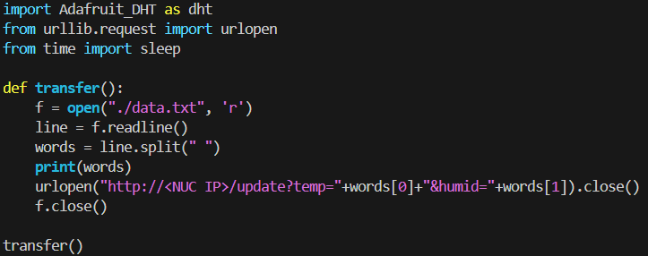

# Lab#3. IoT Lab

# 0. Objective


**이번 Lab의 목표는 IoT 센서를 활용하여 데이터를 수집하고, 이를 서버에 전달하는 IoT-Cloud Hub를 구축하는 것입니다.**

## 0-1. Lab Goal

- 라즈베리파이를 이용한 IoT 센서 데이터 수집
- 센서 데이터를 클라우드 서버로 전송
- Node.js 기반의 웹 서버를 통해 실시간 데이터 시각화

이번 Lab에서는 라즈베리파이(Raspberry Pi) 를 사용하여 센서 데이터를 수집하고, 이를 NUC 서버에서 처리하여 시각화하는 과정을 실습합니다.

## 0-2. IoT-Cloud 시스템이 왜 필요한가?

IoT 기기에서 수집되는 데이터는 개별적으로는 의미가 크지 않지만, 이를 클라우드에서 통합 및 분석하면 강력한 정보나 인사이트를 얻을 수 있습니다. 이러한 데이터는 실시간 모니터링, 자동화, 원격 제어 등의 다양한 분야에서 활용됩니다. Lab#4 - Tower Lab의 모니터링 시스템 구축과 그 필요성이 비슷하며, 이번 Lab에서는 IoT를 활용한 간단한 모니터링 시스템을 구축한다고 볼 수 있습니다.

예를 들어 다음과 같은 분야에 IoT-Cloud 시스템이 적용될 수 있습니다.

- **스마트팜(Smart Farm)**: 비닐하우스에 설치된 토양 습도 센서가 실시간으로 데이터를 클라우드로 전송하고, 이를 기반으로 자동으로 물을 공급합니다. 작물 생장에 최적화된 환경을 유지하면서도 자원을 효율적으로 사용할 수 있습니다.
- **스마트 빌딩(Smart Building)**: 사무실 공간에 설치된 온도 및 동작 감지 센서가 사람의 존재 유무를 감지하여, 조명 및 냉난방(HVAC) 시스템을 자동으로 조절합니다. 이로써 에너지 절약과 쾌적한 환경 유지를 동시에 달성할 수 있습니다.

## 0-3. Node.js

Node.js는 오픈 소스, 크로스 플랫폼을 지원하는 백엔드 JavaScript 런타임 환경으로, V8 엔진에서 실행되며 웹 브라우저 외부에서도 JavaScript 코드를 실행할 수 있습니다. Node.js를 사용하면 개발자가 JavaScript로 명령줄 도구(Command Line Tool)를 작성하거나, 서버 측 스크립트(Server-Side Scripting)를 실행하여 웹 페이지가 사용자에게 전송되기 전에 동적으로 콘텐츠를 생성할 수 있습니다. 결과적으로, Node.js는 "JavaScript everywhere" 패러다임을 실현하여, 서버와 클라이언트에서 각각 다른 언어를 사용할 필요 없이 단일 프로그래밍 언어(JavaScript)로 웹 애플리케이션을 개발할 수 있도록 해줍니다. 이번 Lab에서는 IoT 센서 데이터를 저장하고 간단한 시각화를 위해 Node.js를 사용합니다.

## 0-4. Adafruit_python_DHT

온습도 센서를 손쉽게 사용하기 위해 Adafruit_python_DHT를 사용합니다. Adafruit_python_DHT는 Adafruit에서 제공하는 Python 라이브러리로, DHT11, DHT22, AM2302 등의 온습도 센서를 Raspberry Pi 및 BeagleBone과 같은 SBC(Single Board Computer)에서 쉽게 사용할 수 있도록 지원합니다. 이 라이브러리는 센서 데이터를 읽고 처리하는 기능을 제공하며, 간단한 Python 코드로 온도 및 습도를 측정할 수 있습니다.

# 1. Preparation


위 이미지는 라즈베리파이의 **GPIO(General Purpose Input/Output, 범용 입출력) 핀 배치도**를 나타냅니다. GPIO는 라즈베리파이에서 외부 장치와 연결하여 전기 신호를 주고 받을 수 있는 핀입니다. 간단히 말해, 센서, LED, 모터 등 다양한 기기를 연결하여 입력을 받거나 출력을 보낼 수 있는 다목적 핀이라고 볼 수 있습니다.

- 빨간색 핀(3.3V 전원): 이 핀은 3.3V 전원을 출력하며, 저전력 센서 및 기타 주변 장치에 안정적인 전압을 공급하는 데 사용됩니다.
- 노란색 핀(GPIO4): 일반적인 GPIO 핀으로, 다양한 입력 및 출력 역할을 수행할 수 있습니다.
- 검은색 핀(GND): 전자의 흐름이 돌아오는 길(기준점) 역할을 합니다. 센서나 LED를 연결할 때 전원(여기서는 3.3V)과 함께 항상 필요한 핀입니다.

> [!important]
>
> **이제 위 사진의 빨간색 상자 내부처럼 라즈베리파이에 온습도 센서를 연결해줍니다. 실물 사진은 아래를 참고해주세요!**


---

# 2. Practice

## 2-1. Node.js 웹 서버를 위한 Docker Container 실행 ( in NUC )

### 2-1-1. 웹 서버 코드 확인

빌드 전에 웹서버 코드를 확인해보세요. (별도의 수정은 필요하지 않습니다.)

이 웹서버는 요청의 path에 따라

1. 값을 전달 받아 정보를 업데이트 하거나
2. 저장된 정보를 json 형식으로 반환해주는 역할을 합니다.

```bash
vim ~/SmartX-Mini-2026/Experiment/'Lab-3. IoT'/deploy/webserver/webserver.js
```


### 2-1-2. Docker Image 빌드

webserver 디렉토리로 이동한 뒤 Docker 이미지를 빌드합니다.

```bash
cd ~/SmartX-Mini-2026/Experiment/'Lab-3. IoT'/deploy/webserver

sudo docker build -t webserver .
```

### 2-1-3. Pi로 파일 전송

Pi에서 사용할 파일들을 압축하여 scp로 전송합니다.

```bash
cd ~/SmartX-Mini-2026/Experiment/'Lab-3. IoT'/deploy

tar -czf pi.tar.gz pi/

scp pi.tar.gz pi@<PI_IP>:~/
```

### 2-1-4. Docker Container 실행

빌드한 이미지를 백그라운드로 실행합니다. 컨테이너가 시작되면 웹서버가 자동으로 실행됩니다.

```bash
sudo docker run -d --net host --name webserver webserver
```

## 2-2. 온습도 센서 테스트 ( in PI )

이제 라즈베리파이에 연결된 온습도 센서가 제대로 동작하는지 확인하겠습니다.

### 2-2-1. Install package

아래 명령어를 입력해 필요한 파일들을 다운로드 해주세요

```bash
cd ~
git clone https://github.com/adafruit/Adafruit_python_DHT.git
```

> **Adafruit_python_DHT?** `0-4. Adafruit_python_DHT` 참고

라즈베리파이 버전 4를 3으로 인식할 수 있도록 Adafruit_DHT의 패키지 Installer를 수정해줘야합니다.

> [!note] Why?
>
> 라즈베리파이 4의 SoC(System on Chip)는 `BCM2711`이지만, 기존 Adafruit_python_DHT 라이브러리는 이를 인식하지 못하고 기본적으로 지원하는 BCM2835, BCM2837 등과 다르게 처리합니다. 따라서, platform_detect.py 파일에서 `BCM2711`을 Pi 3으로 인식하도록 설정하면 라이브러리가 정상적으로 작동하며, 추가적인 호환성 문제 없이 센서 데이터를 읽을 수 있습니다.

우선, 파일을 열어줍니다

```bash
cd ~/Adafruit_python_DHT

sudo vim Adafruit_DHT/platform_detect.py
```

**BCM2711**에 대한 case를 `pi_version` 함수에 추가해주고, 3을 return하도록 합니다.

```python
def pi_version():
    …
    elif match.group(1) == 'BCM2835':
        # Pi 3 or Pi 4
        return 3
    elif match.group(1) == 'BCM2837':
        # Pi 3b+
        return 3
    elif match.group(1) == 'BCM2711': # 추가
        # Pi 4b
        return 3                      # 추가
    else:
        # Something else, not a pi.
        return None

```

패키지 Installer를 수정했으므로, 이제 필요한 패키지들을 설치해줍니다. 약간 시간이 걸릴 수 있습니다.

```bash
sudo apt-get update

sudo apt-get install -y python3-pip

sudo python3 -m pip install --upgrade pip setuptools wheel

sudo apt install -y build-essential python3-dev

sudo pip3 install .
```

<details>
<summary>Package Versions (Expand)</summary>

#### PI initial dependencies

|     Package     |   Version   |
| :-------------: | :---------: |
|   python3-pip   | 18.1-5+rpt1 |
| build-essential |    12.6     |
|   python3-dev   |   3.7.3-1   |

#### Python initial dependencies

|  Package   |   Version   |
| :--------: | :---------: |
| setuptools |  40.8.0-1   |
|   wheel    | 18.1-5+rpt1 |

</details>

### 2-2-2. 온습도 센서 테스트 ( in PI )

예제 폴더로 이동합니다.

```bash
cd ~/Adafruit_python_DHT/examples
```

테스트 코드를 열고, `python`을 `python3`로 수정합니다

```bash
sudo vim AdafruitDHT.py
```

From

```python
#!/usr/bin/python
...

```

To

```python
#!/usr/bin/python3
...

```

테스트 코드를 실행합니다.

```bash
sudo ./AdafruitDHT.py 11 4
```

아래와 같이 온도와 습도가 잘 표기됐다면, 온습도 센서가 라즈베리파이에 제대로 연결된 것을 의미합니다. 만약 오류가 발생한다면, 아래 순서를 따라주세요.

1. `1. Preparation`으로 돌아가서 온습도 센서의 핀이 올바른 GPIO 핀에 꽂혀있는지 확인해주세요.
2. 아무런 문제를 발견하지 못했다면, **패키지 설치가 제대로 됐는지 확인해주세요**. 패키지를 다시 설치해보는 것도 방법이 될 수 있습니다.
3. 센서 자체의 문제일 수 있습니다. 만약 여전히 문제가 해결되지 않았다면, 조교를 호출해주세요.


## 2-3. 센서 데이터 수집과 전송 ( in PI )

이번에는 라즈베리파이에서 수집한 센서 데이터를 NUC으로 전달하기 위해, 관련 코드를 수정하겠습니다.

### 2-3-1. 필요한 패키지 설치

```bash
sudo apt-get update

sudo apt-get install -y python3-numpy

sudo apt-get install -y mercurial
```

<details>
<summary>Package Versions (Expand)</summary>

#### PI analysis dependencies

|    Package    |     Version     |
| :-----------: | :-------------: |
| python3-numpy |   1:1.16.2-1    |
|   mercurial   | 4.8.2-1+deb10u1 |

</details>

### 2-3-2. 센서 데이터 수집 코드

NUC에서 전송받은 파일의 압축을 해제합니다.

```bash
cd ~
tar -xzf pi.tar.gz
```

아래 명령어를 입력해 센서 데이터 수집 코드를 확인해보세요. (별도의 수정은 필요하지 않습니다.)

**이 코드는 라즈베리파이에서 실행되며, 센서로부터 데이터를 읽어와 파일에 저장하는 역할을 합니다.**

```bash
vim ~/pi/RPI_capture.py
```


### 2-3-3. 센서 데이터 전송 코드

저장된 센서 데이터를 전송하는 코드를 열고, `<NUC IP>`를 여러분의 NUC IP로 수정합니다.

```bash
vim ~/pi/RPI_transfer.py
```



## 2-4. IoT Web Service 실행하기

이제 지금까지 작업한 내용을 바탕으로 간단한 IoT Web Service를 실행하도록 하겠습니다.

### 2-4-1. 센서 데이터를 수집하고 전송하기 ( in PI )

다음의 명령어를 실행해주세요. `process.sh`는 방금 전 살펴본 `RPI_capture.py`와 `RPI_transfer.py` 파일을 반복적으로 실행합니다.

```bash
cd ~/pi

# 실행 권한 부여
chmod +x process.sh

sudo ./process.sh
```

### 2-4-2. IoT Web Service 접속하기 ( in NUC )

NUC에서 웹브라우저를 열고 `http://<NUC IP>`에 접속해주세요.

다음과 같은 화면을 확인한다면 성공입니다! 새로고침을 눌러, 온습도 센서 데이터가 지속적으로 바뀌는 것을 확인해보세요.


---

# 3. Lab Summary

이 Lab의 목표는 IoT 센서를 활용하여 데이터를 수집하고, 이를 서버에 전달하는 IoT-Cloud Hub를 구축하는 것입니다.
여러분은 라즈베리파이를 활용하여 IoT 센서 데이터를 수집하고, 이를 NUC에 위치한 웹서버로 전송하여 시각화하는 IoT-Cloud 시스템을 구축하는 실습을 진행했습니다.

## (Recall) IoT-Cloud 시스템이 왜 필요한가?

IoT 기기에서 수집된 데이터는 개별적으로는 의미가 크지 않지만, 이를 클라우드에서 통합 및 분석하면 실시간 모니터링, 자동화, 원격 제어 등 다양한 분야에서 강력한 활용이 가능합니다. 이번 Lab에서는 IoT 데이터를 처리하고 웹에서 시각화하여, Tower Lab에서 다뤘던 모니터링 시스템과 유사한 IoT 기반 데이터 모니터링의 개념을 실습했습니다.

## 주요 과정 요약

1. 라즈베리파이 GPIO 핀을 활용하여 온습도 센서 연결 및 테스트
2. 온습도 센서 데이터를 NUC 서버로 전송
3. Node.js 기반의 웹 서버에서 데이터 시각화
