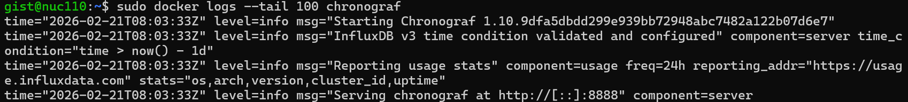

# Lab#4. Tower Lab

# 0. Objective


**The goal of this Lab is to build a Tower (monitoring system) that can monitor a system and visualize the monitored data.**

## 0-1. Lab Goal

- Real-time system status monitoring
- Storage and analysis of large-scale time-series data
- Intuitive understanding of system data through visualization
- Workflow: Data collection via Kafka → Storage in InfluxDB → Visualization via Chronograf

We will use the Kafka cluster built in **Lab#2 (InterConnect Lab)**.

## 0-2. Why is a monitoring system necessary?

Real-time monitoring is essential to maintain system performance and stability. It enables fast detection and response to system failures and allows performance optimization and capacity planning based on analysis of time-series data. Especially in distributed systems, it is crucial to collectively analyze data collected from various nodes, which requires a system that can effectively store and visualize the data.

In this Lab, we will learn how to build such a monitoring system using `Flume` and `Kafka` for data collection, `InfluxDB` for time-series storage, and `Chronograf` for visualization.

## 0-3. TSDB (Time Series Database)

### Visualization and monitoring of time-series data


Time-series data refers to data that changes over time, where each data point represents a value at a specific timestamp. Examples include server CPU usage, network traffic, IoT sensor data, and financial market data. A **Time Series Database** is optimized to efficiently store and query such data, allowing fast lookup, real-time analysis, and long-term trend detection.

## 0-4. InfluxDB


**InfluxDB** is an open-source time-series database developed by InfluxData.  
Written in the Go programming language, it is used in various domains to store and retrieve time-series data such as operational monitoring, application metrics, IoT sensor data, and real-time analytics.

> [!note]
>
> **Most of the IT companies you'd think of use InfluxDB to handle time-series data.**

## 0-5. Chronograf


### Simple monitoring system architecture using InfluxDB and Chronograf


Chronograf is the user interface (UI) and administrative component used with InfluxDB 1.x.  
It provides an easy way to browse stored data in InfluxDB, create queries and alerts, and quickly build dashboards using templates and libraries for real-time visualization.

# 1. Practice

## 1-1. Create and Run InfluxDB Container ( in NUC )

```bash
sudo docker run -d --net host --name influxdb influxdb:1.7
```

Now **InfluxDB** is running. It uses **port 8086**, and because we used `--net host`, we can access it via `localhost:8086` or `<NUC IP>:8086`.

## 1-2. Create and Run Chronograf Container ( in NUC )

Run the following command with the appropriate InfluxDB URL to launch the **Chronograf container**.

```bash
sudo docker run -p 8888:8888 --name chronograf chronograf --influxdb-url http://<NUC IP>:8086
```

- **What does `-p 8888:8888` do?**
  - Maps host's port 8888 to container's port 8888
  - This means that if you access to host's port 8888, then it will be forwarded to container's 8888 port.
  - Allows you to access the Chronograf UI via `localhost:8888` or `<NUC IP>:8888`
  - `-p <host port>:<container port>`

- **Difference between `--net host` and `-p 8888:8888`?**
  - `-p 8888:8888`
    - More secure because only the required port (8888) of host's ports is exposed.
    - - However, you have to explicitly map the ports each time.
  - `--net host`
    - Container will use host's network as is.
    - This means that if you open port 8888 inside container, the same port 8888 will be available on host.
    - You don't need to set a port mapping.

If it appears as below, it means that the chronograph has started successfully.



## 1-3. Install python-pip and Python packages ( in NUC )

### 1-3-1. Install python-pip

Open a new terminal and run the commands!

> [!tip]
>
> **Open new terminal: `Ctrl+Shift+t`, Open new terminal: `Ctrl+Alt+N`**

```bash
sudo apt-get install -y libcurl4 openssl curl python3-pip
```

<details>
<summary>Package Versions (Expand)</summary>

#### NUC

|   Package   |      Version       |
| :---------: | :----------------: |
|  libcurl4   | 7.68.0-1ubuntu2.15 |
|   openssl   | 1.1.1f-1ubuntu2.16 |
|    curl     | 7.68.0-1ubuntu2.15 |
| python3-pip | 20.0.2-5ubuntu1.7  |

</details>

### 1-3-2. Install Python Packages

```bash
sudo pip install requests kafka-python influxdb msgpack --break-system-packages
```

<details>
<summary>Package Versions (Expand)</summary>

#### Python

|   Package    | Version |
| :----------: | :-----: |
|   requests   | 2.22.0  |
| kafka-python |  2.0.2  |
|   influxdb   |  5.3.1  |
|   msgpack    |  1.0.4  |

</details>

## 1-4. Start Kafka Cluster

Use the **Kafka cluster from Lab#2** — restart **zookeeper, broker0, broker1, and broker2 containers**.

### 1-4-1. Restart Kafka Cluster Containers

With the command below, you can check the exited containers which are zookeeper, broker0, broker1, broker2, consumer.

```bash
sudo docker ps -a
```

We need to restart the zookeeper, brokers containers. Run the command below to restart the containers.

```bash
sudo docker start zookeeper broker0 broker1 broker2
```

### 1-4-2. Attach to Kafka Containers

You can connect to the terminal of each docker container with these commands. Connect to `zookeeper`, `broker0`, `broker1`, and `broker2` in order, and perform the actions corresponding to the case below each time you connect to each container.

```bash
sudo docker attach zookeeper

# at new terminal (ctrl+shift+t)
sudo docker attach broker0

# at new terminal (ctrl+shift+t)
sudo docker attach broker1

# at new terminal (ctrl+shift+t)
sudo docker attach broker2
```

#### Case 1: `zookeeper` container

Enter the command below. The `bin/zookeeper-server.start.sh` is the file that runs the zookeeper server, and the `config/zookeeper.properties` is already modified in Lab2, so no further modifications are required.

```bash
bin/zookeeper-server-start.sh config/zookeeper.properties
```

#### Case 2: `broker` container (broker0, broker1, broker2)

Enter the command below. The `bin/kafka-server-start.sh` is the file that runs the broker server, and the `config/server.properties` is already modified in Lab2, so no further modifications are required.

```bash
bin/kafka-server-start.sh config/server.properties
```

## 1-5. Flume container ( in PI )

### 1-5-1. `/etc/hosts`

If Pi is rebooted, previously written `/etc/hosts` entries might be lost. Add them again:

```bash
sudo vim /etc/hosts
```

If the information you previously entered is missing, please add the following two lines and save.

> [!warning]
>
> You should replace `<>` with your information.

```txt
<NUC_IP> <NUC_HOSTNAME>
<PI_IP> <PI_HOSTNAME>
```

### 1-5-2. Run Flume Container

Enter these commands to run flume container, and access the inside of the container.

```bash
# Execute Container
sudo docker start flume
# Access to Container
sudo docker attach flume
```

Then run Flume:

```bash
bin/flume-ng agent --conf conf --conf-file conf/flume-conf.properties --name agent -Dflume.root.logger=INFO,console
```

## 1-6. Python File `broker_to_influxdb.py` ( in NUC )

`broker_to_influxdb.py` receives messages from Kafka brokers and writes them to InfluxDB.

### 1-6-1. Edit `broker_to_influxdb.py`

> [!note]
>
> Please open a new terminal.

```bash
vim ~/SmartX-Mini/SmartX-Box/ubuntu-kafkatodb/broker_to_influxdb.py
```

In this file, you should replace `<NUC IP>` with your real NUC IP.

> e.g. `172.10.109.100`


### 1-6-2. Run `broker_to_influxdb.py`

Enter the command below to run `broker_to_influxdb.py` with the settings for the file descriptor and handle.

```bash
sudo sysctl -w fs.file-max=100000
ulimit -S -n 2048
python3 ~/SmartX-Mini/SmartX-Box/ubuntu-kafkatodb/broker_to_influxdb.py
```

## 1-7. Chronograf Dashboard ( in NUC )

### 1-7-1. Access Chronograf Dashboard

Open a web browser and access the Chronograf Dashboard.

> **Access URL**: `http://<Your NUC IP>:8888`


### 1-7-2. Creating a Dashboard


### 1-7-3. Adding a Data Source


### 1-7-4. Registering a Query


```sql
SELECT "memory" FROM "Labs"."autogen"."labs" WHERE time > :dashboardTime:
```

### 1-7-5. Monitoring

#### Memory Monitoring

You can monitor the current memory usage.


#### CPU Monitoring

You can monitor the current CPU usage.


#### CPU Load Test ( in PI )

To verify that the monitoring system is correctly visualizing data, you can intentionally generate CPU load.

First, change the field in the Chronograf Dashboard to `CPU_Usage`.


Then, **run the following command on the PI.**

```bash
docker run --rm -it busybox sh -c "while true; do :; done"
```

If you keep refreshing the dashboard, you’ll see the graph rising upward.

Once confirmed, press `Ctrl + C` to stop the CPU load ( in PI ).

# 2. Lab Summary

The goal of this Lab was to build a monitoring and data visualization system (Tower).
To achieve this, you collected data using a Kafka cluster, stored it in InfluxDB, and visualized it through Chronograf.

## (Recall) Why this lab?

- Real-time system status monitoring
- Storage and analysis of large-scale time-series data
- Intuitive understanding of system data through visualization
- Workflow: Kafka-based data collection → Storage in InfluxDB → Visualization with Chronograf

## Summary of Key Steps

1. Run InfluxDB container → TSDB for storing data
2. Run Chronograf container → Web UI to visualize InfluxDB data
3. Restart Kafka cluster → Reactivate Kafka built in previous Lab
4. Run Flume → Start Flume agent for streaming data
5. Run Python (Kafka) Consumer (broker_to_influxdb.py) → Consume data from Kafka Broker and store it in InfluxDB
6. Configure Chronograf dashboard → Visually inspect InfluxDB data in the browser
