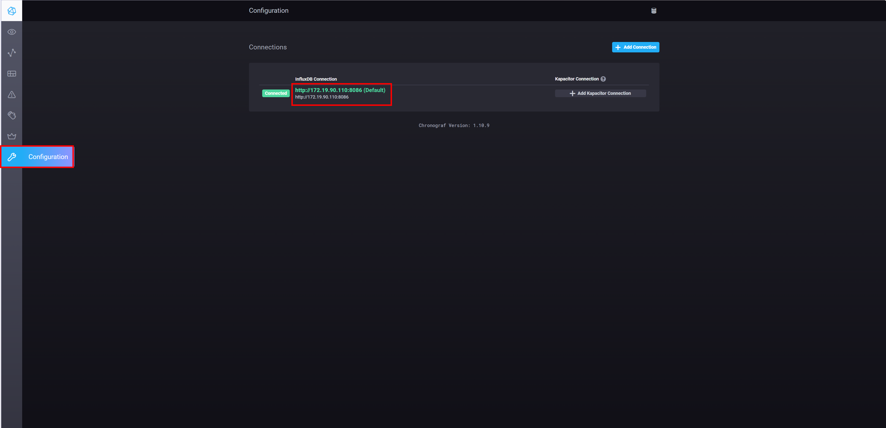
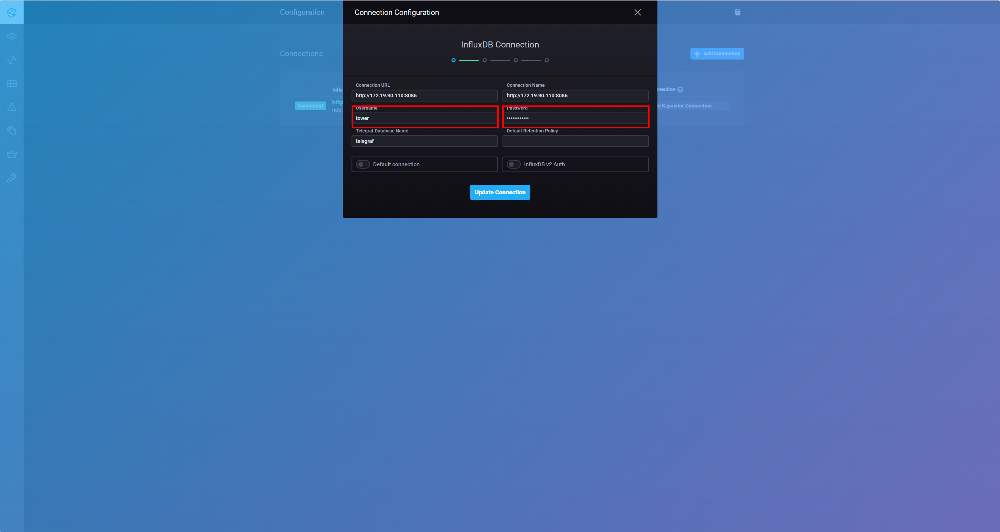
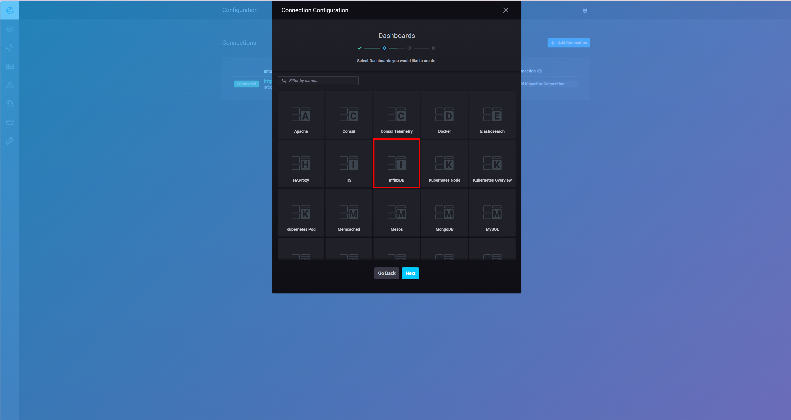
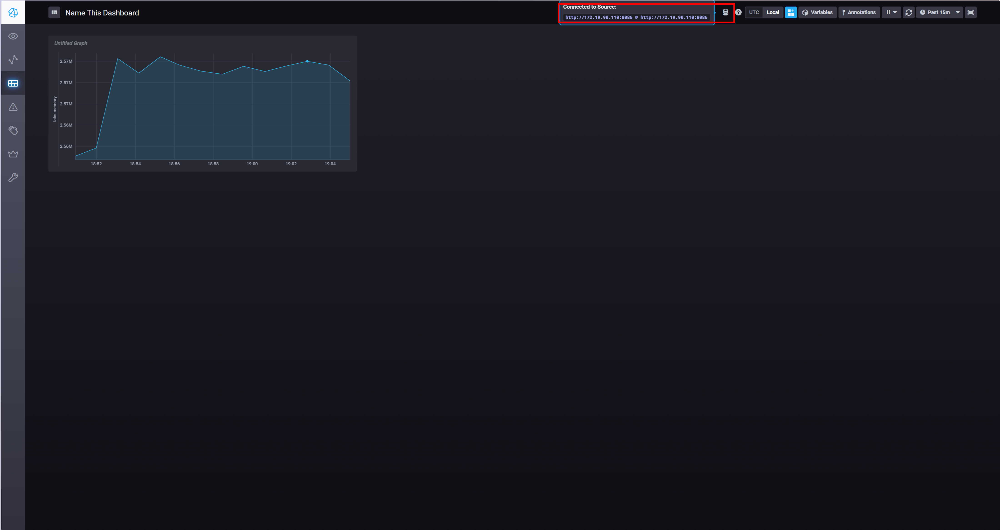

# Lab#4. Tower Lab

# 0. Objective


**The goal of this Lab is to build a Tower (monitoring system) that monitors system status and visualizes collected data.**

## 0-1. Lab Goal

- Real-time system status monitoring
- Storage and analysis of large-scale time-series data
- Intuitive understanding of system data through visualization
- Workflow: Kafka-based data collection -> InfluxDB storage -> Chronograf visualization

We use the Kafka cluster built in **Lab#2 (InterConnect Lab)**.

## 0-2. Why is a monitoring system necessary?

Real-time monitoring is essential for maintaining system performance and stability. It allows fast detection and response to failures, and supports performance optimization and capacity planning through time-series analysis. In distributed systems, data from multiple nodes must be analyzed together, so an effective storage and visualization system is required.

In this Lab, you will build a monitoring pipeline using `Fluentd` and `Kafka` for data collection, `InfluxDB` for time-series storage, and `Chronograf` for visualization.

## 0-3. TSDB (Time Series Database)

### Visualization and monitoring of time-series data


Time-series data represents values measured over time, where each data point is associated with a timestamp. Examples include server CPU usage, network traffic, IoT sensor data, and financial market data. A **Time Series Database** is optimized for efficiently storing and querying this type of data, enabling fast lookup, real-time analysis, and long-term trend analysis.

## 0-4. InfluxDB


**InfluxDB** is an open-source Time Series Database (TSDB) developed by InfluxData.
Written in Go, it is widely used to store and query time-series data for operational monitoring, application metrics, IoT sensors, and real-time analytics.

> [!NOTE]
>
> **Most major IT companies use InfluxDB for time-series workloads.**

## 0-5. Chronograf


### Simple monitoring architecture with InfluxDB and Chronograf


Chronograf is a web UI for browsing and visualizing InfluxDB time-series data.
In this Lab, we use InfluxDB 2.8 and also configure InfluxDB v1 compatibility (`Labs.autogen`) so existing practice code continues to work.

# 1. Practice

## 1-1. Create and Run InfluxDB 2.8 Container ( in NUC )

If an old `influxdb` container is already running, remove it first.

```bash
sudo docker rm -f influxdb 2>/dev/null || true
```

Define the InfluxDB admin password and admin token as environment variables.

```bash
export INFLUXDB_ADMIN_PASSWORD='SxMiniAdmin!2026'
export INFLUXDB_ADMIN_TOKEN="$(openssl rand -hex 32)"
```

Run the **InfluxDB 2.8** container.

```bash
sudo docker run -d \
  --net host \
  --name influxdb \
  -v influxdb2-data:/var/lib/influxdb2 \
  -e DOCKER_INFLUXDB_INIT_MODE=setup \
  -e DOCKER_INFLUXDB_INIT_USERNAME=admin \
  -e DOCKER_INFLUXDB_INIT_PASSWORD="$INFLUXDB_ADMIN_PASSWORD" \
  -e DOCKER_INFLUXDB_INIT_ORG=GIST \
  -e DOCKER_INFLUXDB_INIT_BUCKET=Labs \
  -e DOCKER_INFLUXDB_INIT_ADMIN_TOKEN="$INFLUXDB_ADMIN_TOKEN" \
  influxdb:2.8
```

InfluxDB uses **port 8086**. Because we use `--net host`, access it via `localhost:8086` or `<NUC IP>:8086`.

### 1-1-1. Configure InfluxDB v1 compatibility (for Chronograf / Python consumer)

To keep using existing `broker_to_influxdb.py` and Chronograf queries (`Labs.autogen`), add v1 compatibility settings.

First, get the `Labs` bucket ID and store it in an environment variable.

```bash
LABS_BUCKET_ID=$(sudo docker exec influxdb influx bucket list --name Labs | awk 'NR==2 {print $1}')
```

Create a DBRP mapping using `LABS_BUCKET_ID`.

```bash
sudo docker exec influxdb influx v1 dbrp create \
  --db Labs \
  --rp autogen \
  --default \
  --bucket-id $LABS_BUCKET_ID \
  --org GIST \
  --token $INFLUXDB_ADMIN_TOKEN
```

If DBRP mapping is created successfully, output will look similar to:

```bash
ID                      Database        Bucket ID               Retention Policy        Default Organization ID
104bca211b4ac000        Labs            a239a82440d4728d        autogen                 true    1b30065610067f7a
```

Create a v1-compatible auth account.

> [!TIP]
>
> `INFLUXDB_V1_PASSWORD` is used in URL query strings, so alphanumeric values are recommended.

```bash
export INFLUXDB_V1_USER=tower
export INFLUXDB_V1_PASSWORD='SxMiniV12026'

sudo docker exec influxdb influx v1 auth create \
  --username tower \
  --password $INFLUXDB_V1_PASSWORD \
  --read-bucket $LABS_BUCKET_ID \
  --write-bucket $LABS_BUCKET_ID \
  --org GIST \
  --token $INFLUXDB_ADMIN_TOKEN
```

## 1-2. Create and Run Chronograf Container ( in NUC )

Create the **Chronograf container** using the InfluxDB URL.

```bash
sudo docker rm -f chronograf 2>/dev/null || true
sudo docker run -d -p 8888:8888 --name chronograf chronograf --influxdb-url http://<NUC IP>:8086
```

Verify Chronograf is running normally.

```bash
sudo docker logs --tail 100 chronograf
```


- **What does `-p 8888:8888` do?**
  - Maps host port 8888 to container port 8888.
  - Accessing host port 8888 is forwarded to Chronograf in the container.
  - You can access the UI via `localhost:8888` or `<NUC IP>:8888`.
  - Format: `-p <host port>:<container port>`

- **Difference between `--net host` and `-p 8888:8888`**
  - `-p 8888:8888`
    - Exposes only required ports.
    - Requires explicit port mapping.
  - `--net host`
    - Container uses host networking directly.
    - No separate port mapping required.

## 1-3. Install Python venv and packages ( in NUC )

### 1-3-1. Install python-pip / venv modules

On Python 3.12 (Externally Managed Environment), global `pip install` may be restricted, so install `venv` together.

```bash
sudo apt-get install -y libcurl4 openssl curl python3-pip python3-venv
```

### 1-3-2. Activate virtual environment and install Python packages

<!-- TODO: pip path edit, .gitignore update needed -->

Activate the Python venv created in Lab 2, then install packages.

```bash
source ~/.venv/bin/activate
python -m pip install --upgrade pip
pip install requests kafka-python influxdb msgpack
```

Check installed versions if needed.

```bash
pip show requests kafka-python influxdb msgpack
```

> [!TIP]
>
> Every time you open a new terminal, run `source ~/.venv/bin/activate` before running Python commands.

## 1-4. Start Kafka Cluster (KRaft, in NUC)

Restart the Kafka KRaft cluster from Lab2:
`controller0`, `controller1`, `controller2`, `broker0`, `broker1`, `broker2`.

### 1-4-1. Restart Kafka cluster containers

Check current container status first.

```bash
sudo docker ps -a --format "table {{.Names}}\t{{.Status}}" | egrep "controller|broker"
```

If stopped, start them with:

```bash
sudo docker start controller0 controller1 controller2 broker0 broker1 broker2
```

### 1-4-2. Verify Kafka status and topic

In KRaft mode, `zookeeper` is not used.
Check controller/broker status and whether the `resource` topic exists.

```bash
sudo docker ps --format "table {{.Names}}\t{{.Status}}" | egrep "controller|broker"

sudo docker exec broker0 /kafka/bin/kafka-topics.sh --list \
  --bootstrap-server localhost:9090
```

If `resource` does not exist, create it.

```bash
sudo docker exec broker0 /kafka/bin/kafka-topics.sh --create \
  --bootstrap-server localhost:9090 \
  --replication-factor 3 \
  --partitions 3 \
  --topic resource
```

## 1-5. Fluentd container ( in PI )

### 1-5-1. `/etc/hosts`

If the PI reboots, `/etc/hosts` entries may be lost. Re-add IP/hostname entries if needed.

```bash
sudo vim /etc/hosts
```

If previous entries are missing, add the two lines below.

> [!WARNING]
>
> Replace `<>` with your own values.

```txt
<NUC_IP> <NUC_HOSTNAME>
<PI_IP> <PI_HOSTNAME>
```

### 1-5-2. Run Fluentd container

Use the `pi-fluentd` image created in Lab2.

```bash
sudo docker run -it --rm \
  --net=host \
  --security-opt seccomp=unconfined \
  --name fluentd \
  pi-fluentd
```

> [!NOTE]
>
> If `pi-fluentd` does not exist, first complete Lab2 steps:
> `2-5-2. (NUC) Fluentd image cross-build`
> and `2-5-3. (PI) Load image and run Fluentd`.

## 1-6. Python File `broker_to_influxdb.py` ( in NUC )

`broker_to_influxdb.py` acts as a Kafka consumer that receives messages from Kafka brokers and writes them to InfluxDB.

### 1-6-1. Edit `broker_to_influxdb.py`

> [!NOTE]
>
> Open a new terminal first.

```bash
vim ~/SmartX-Mini/SmartX-Box/ubuntu-kafkatodb/broker_to_influxdb.py
```

```python
# before
consumer = KafkaConsumer('resource',bootstrap_servers=['<NUC_IP>:9091'])
consumer = KafkaConsumer('resource', bootstrap_servers=['<NUC_IP>:9091'])
cmd = "curl -XPOST 'http://localhost:8086/query' --data-urlencode 'q=CREATE DATABASE Labs'"
cmd = "curl -i -XPOST 'http://localhost:8086/write?db=Labs' --data-binary '...'"

# after
consumer = KafkaConsumer('resource',bootstrap_servers=['localhost:9090'])
consumer = KafkaConsumer('resource', bootstrap_servers=['localhost:9090'])
# Labs bucket is already created in step 1-1, so remove (or comment out) CREATE DATABASE.
# Handle write URL auth (u/p) via env vars INFLUXDB_V1_USER and INFLUXDB_V1_PASSWORD.
cmd = "curl -sS -XPOST 'http://localhost:8086/write?db=Labs&u=<INFLUXDB_V1_USER>&p=<INFLUXDB_V1_PASSWORD>' --data-binary '...'"
```


### 1-6-2. Run `broker_to_influxdb.py`

Run the script with file-descriptor settings.

```bash
sudo sysctl -w fs.file-max=100000
ulimit -S -n 2048
source ~/.venv/bin/activate

# optional: verify v1 auth / DBRP mapping
curl -sS -XPOST "http://localhost:8086/query?u=${INFLUXDB_V1_USER}&p=${INFLUXDB_V1_PASSWORD}&db=Labs" \
  --data-urlencode "q=SHOW MEASUREMENTS"

python ~/SmartX-Mini/SmartX-Box/ubuntu-kafkatodb/broker_to_influxdb.py
```

## 1-7. Chronograf Dashboard ( in NUC )

### 1-7-1. Access Chronograf dashboard

Open your web browser and access Chronograf.

> **Access URL**: `http://<Your NUC IP>:8888`


### 1-7-2. Config - Update Connections

In Chronograf, update the default connection first and add InfluxDB auth info.
Go to `Configuration -> Connections` and click the default connection.



Enter `INFLUXDB_V1_USER` and `INFLUXDB_V1_PASSWORD` into the username/password fields.



In the Dashboard setup flow, click InfluxDB and skip Kapacitor configuration.



- URL: `http://<NUC IP>:8086`
- Username: `tower`
- Password: `<INFLUXDB_V1_PASSWORD>`

### 1-7-3. Create a dashboard


### 1-7-4. Register a query


```sql
SELECT "memory" FROM "Labs"."autogen"."labs" WHERE time > :dashboardTime:
```

> [!TIP]
>
> If `Submit Query` returns `received status code 401 ... unauthorized access`, check in this order:
>
> 1. Verify v1 auth from CLI first.
>
>    ```bash
>    curl -i -XPOST "http://localhost:8086/query?db=Labs&u=tower&p=<INFLUXDB_V1_PASSWORD>" \
>      --data-urlencode "q=SHOW MEASUREMENTS"
>    ```
>
> 2. If response is `200 OK`, recreate the default connection in `Configuration -> Connections`.
>    - URL: `http://<NUC IP>:8086`
>    - Username: `tower`
>    - Password: `<INFLUXDB_V1_PASSWORD>`
> 3. Make sure the newly created config is selected at the top of the Query page, then submit again.
>
> 

### 1-7-5. Check monitoring

#### Memory monitoring

You can monitor current memory usage.


#### CPU monitoring

You can monitor current CPU usage.


#### CPU load test ( in PI )

To verify visualization behavior, you can intentionally generate CPU load.

First, change the field in Chronograf Dashboard to `CPU_Usage`.


Then run the command below on the PI.

```bash
docker run --rm -it busybox sh -c "while true; do :; done"
```

While refreshing the browser, you should see the dashboard graph move upward.

After confirmation, press `Ctrl + C` to stop the load ( in PI ).

# 2. Lab Summary

The goal of this Lab is to build a Tower system for system monitoring and data visualization.
To do that, data was collected through Kafka, stored in InfluxDB, and visualized in Chronograf.

## (Recall) Why this lab?

- Real-time system status monitoring
- Storage and analysis of large-scale time-series data
- Intuitive understanding of system data through visualization
- Workflow: Kafka-based data collection -> InfluxDB storage -> Chronograf visualization

## Summary of Key Steps

1. Run InfluxDB 2.8 container + configure v1 compatibility (DBRP/Auth) -> keep compatibility with existing code and queries.
2. Run Chronograf container -> Web UI for InfluxDB visualization.
3. Restart Kafka KRaft cluster -> run Lab2 controller/broker containers.
4. Run Fluentd -> start Fluentd agent for streaming data.
5. Run Python (Kafka) consumer (`broker_to_influxdb.py`) -> consume Kafka messages and write to InfluxDB.
6. Configure Chronograf dashboard -> visually inspect InfluxDB data.
